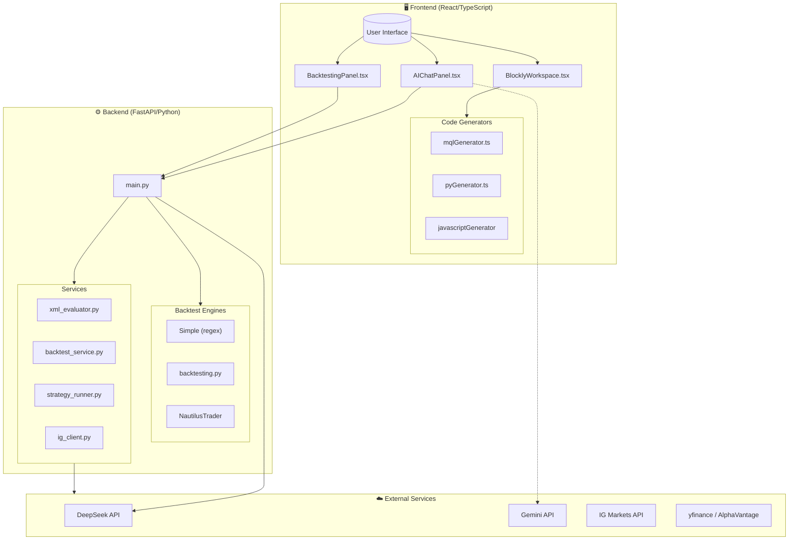
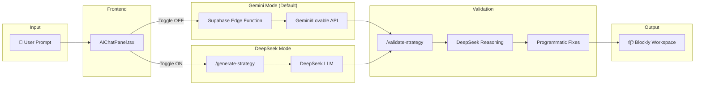
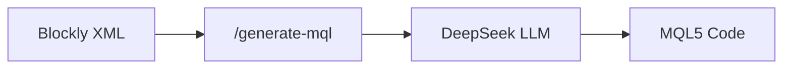
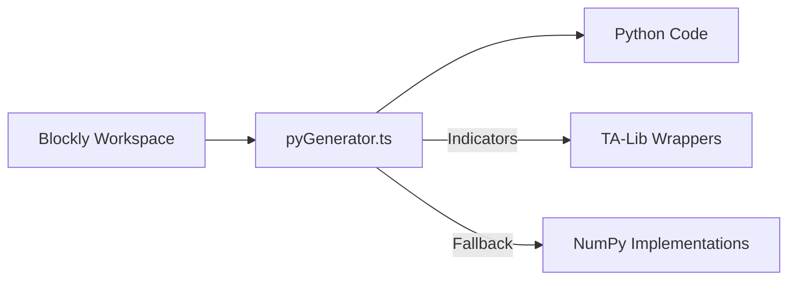
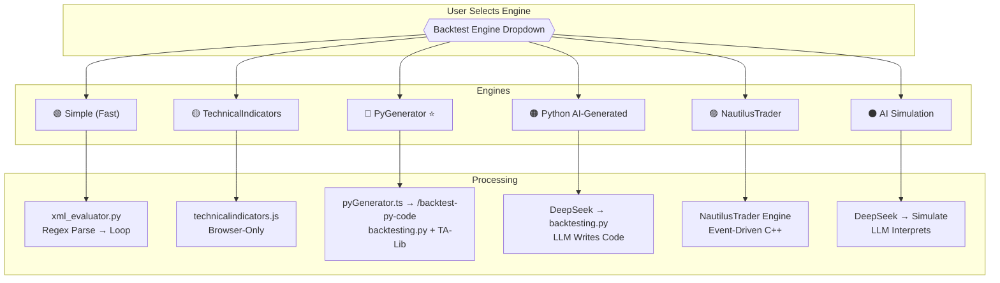
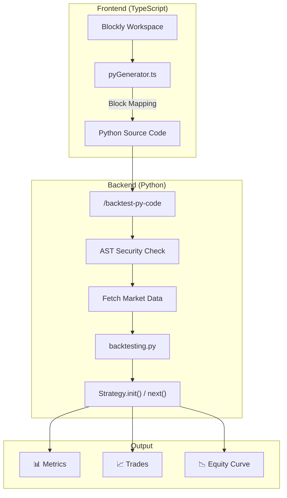
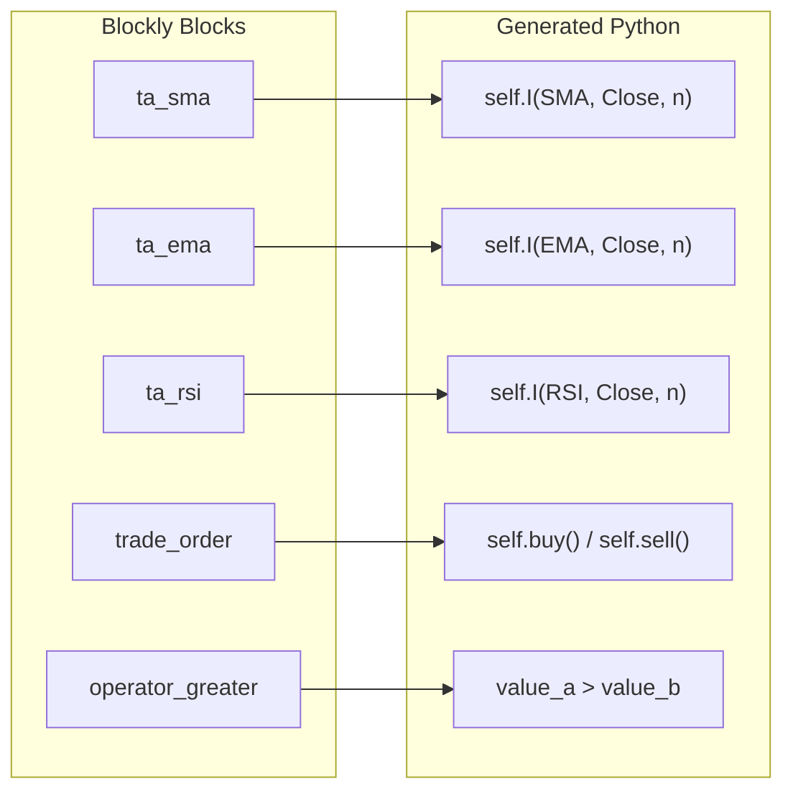
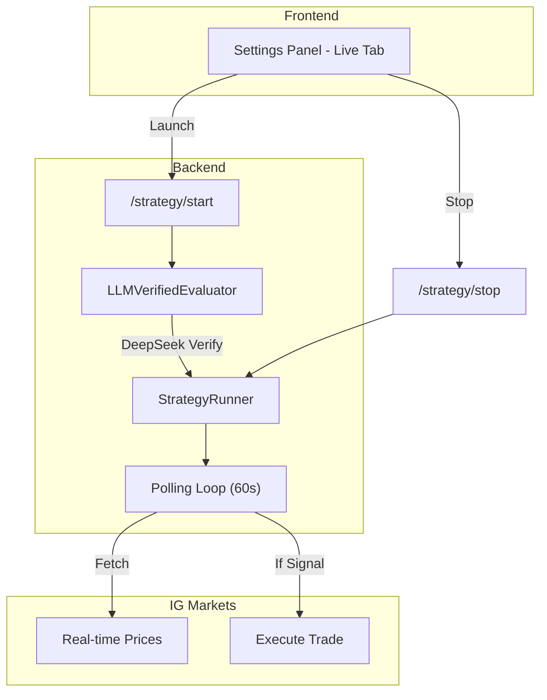
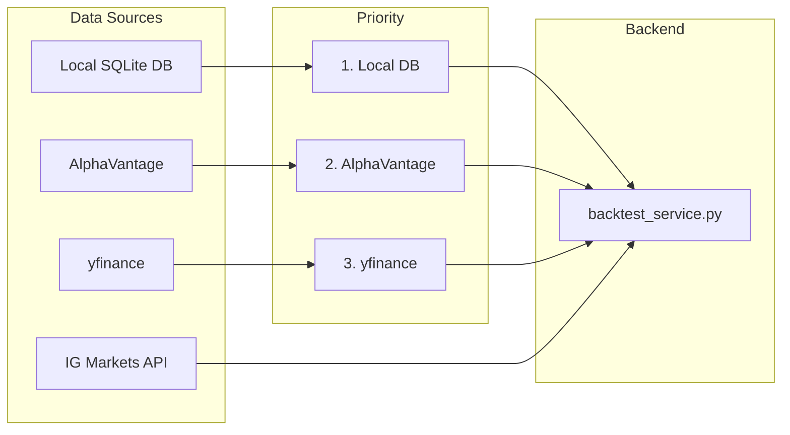
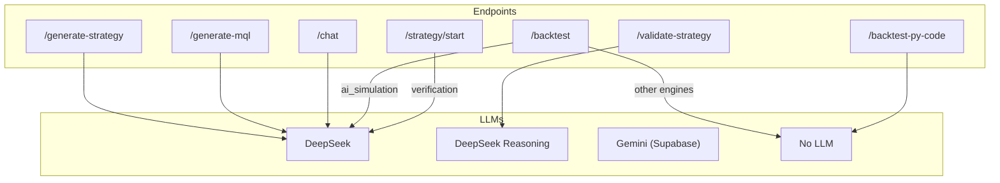

# Application Pipelines Reference

This document describes all major pipelines in the PPM trading strategy application with comprehensive flow diagrams.

---

## Complete System Architecture

---

## 1. Strategy Generation Pipeline

**Purpose:** Convert natural language → Blockly XML visual strategy

### Key Files
| File | Purpose |
|------|---------|
| `src/features/ai/components/AIChatPanel.tsx` | UI + toggle controls |
| `supabase/functions/generate-strategy/index.ts` | Gemini LLM call |
| `backend/main.py` → `/generate-strategy` | DeepSeek generation |
| `backend/main.py` → `/validate-strategy` | DeepSeek Reasoning validation |

---

## 2. Code Generation Pipelines

### MQL5 Generation (LLM-Based)

### Python Generation (Deterministic)

### Key Files
| Generator | File | Output |
|-----------|------|--------|
| MQL5 | `backend/main.py` → `generate_mql()` | MetaTrader EA |
| Python | `src/config/blockly/pyGenerator.ts` | backtesting.py Strategy |
| JavaScript | `src/config/blockly/generator.ts` | Browser execution |

---

## 3. Backtest Engine Comparison

### Engine Details

| Engine | Speed | Reliability | LLM? | Best For |
|--------|-------|-------------|------|----------|
| Simple (Fast) | ⭐⭐⭐⭐ | ⭐⭐ | No | Quick checks |
| TechnicalIndicators | ⭐⭐⭐⭐⭐ | ⭐⭐⭐ | No | Offline testing |
| **PyGenerator** | ⭐⭐⭐⭐⭐ | ⭐⭐⭐⭐⭐ | **No** | **Production** |
| Python (AI-Gen) | ⭐⭐ | ⭐⭐ | Yes | Complex logic |
| NautilusTrader | ⭐⭐⭐⭐ | ⭐⭐ | Yes | HFT simulation |
| AI Simulation | ⭐ | ⭐ | Yes | Exploration |

---

## 4. PyGenerator Pipeline (Recommended)

### pyGenerator Block Mapping

---

## 5. Live Trading Pipeline

### Key Files
| File | Purpose |
|------|---------|
| `backend/strategy_runner.py` | Async polling loop |
| `backend/xml_evaluator.py` | LLM-verified evaluator |
| `backend/ig_client.py` | IG Markets API wrapper |

---

## 6. Data Flow Summary

---

## API → LLM Mapping

| Endpoint | LLM Used | Notes |
|----------|----------|-------|
| `/generate-strategy` | DeepSeek | Full block catalog |
| `/validate-strategy` | DeepSeek Reasoning | Multi-pass validation |
| `/generate-mql` | DeepSeek | XML → MQL5 |
| `/chat` | DeepSeek | Q&A mode |
| `/backtest-py-code` | **None** | PyGenerator (fastest) |
| `/backtest` (legacy) | Optional | Depends on engine |
| `/strategy/start` | DeepSeek | Verification only |

---

## Quick Reference: File → Function → Purpose

| Layer | Key File | Main Function | Purpose |
|-------|----------|--------------|---------|
| Frontend | `pyGenerator.ts` | `workspaceToCode()` | Blocks → Python |
| Frontend | `mqlGenerator.ts` | `workspaceToCode()` | Blocks → MQL5 |
| Frontend | `AIChatPanel.tsx` | `handleSend()` | AI strategy prompt |
| Frontend | `BacktestingPanel.tsx` | `handleRunBacktest()` | Engine dispatcher |
| Backend | `main.py` | `backtest_py_code()` | Execute Python |
| Backend | `main.py` | `generate_strategy()` | DeepSeek generation |
| Backend | `backtest_service.py` | `run_backtest()` | Backtesting logic |
| Backend | `xml_evaluator.py` | `BlocklyXMLEvaluator` | XML parser |
| Backend | `strategy_runner.py` | `StrategyRunner` | Live execution |
| Backend | `ig_client.py` | `IGClient` | Trading API |
