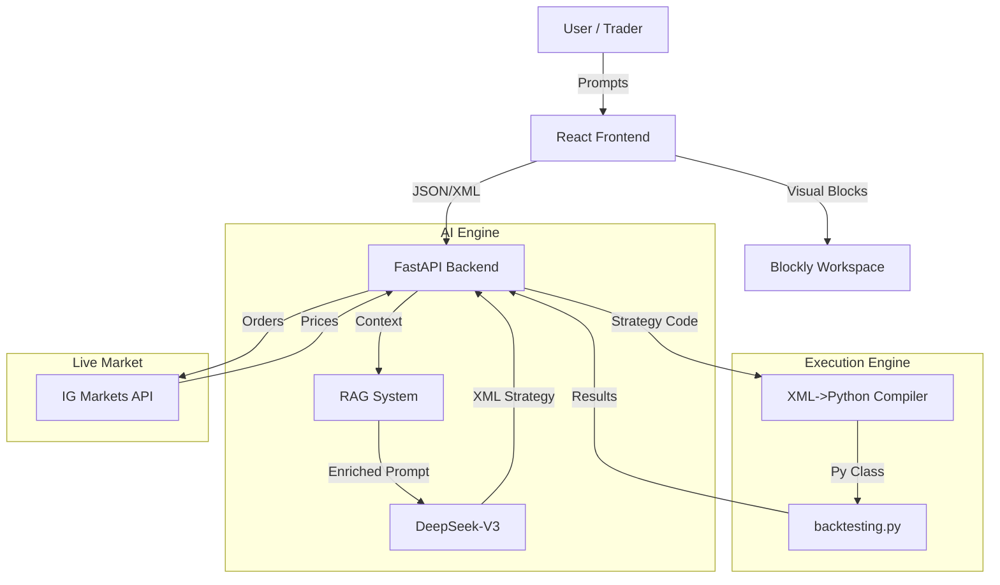

# Project Prometheus (PPM)

**Project Prometheus** is an advanced AI-powered algorithmic trading platform that democratizes strategy creation. It combines a visual drag-and-drop interface (Blockly) with a powerful Generative AI engine (DeepSeek + RAG) to allow users to create, backtest, and deploy trading strategies using natural language or visual blocks.


## 🚀 Key Features

*   **🤖 AI Strategy Generation**: Describe your strategy in plain English (e.g., *"Buy EURUSD when RSI < 30 and price is above SMA 200"*). The system uses **RAG (Retrieval Augmented Generation)** and **DeepSeek-V3** to construct a valid visual strategy.
*   **🧩 Visual Builder**: Powered by Google Blockly. Modify AI-generated strategies or build from scratch using typed, validating blocks for Indicators, Logic, and Trade Actions.
*   **📉 Robust Backtesting**:
    *   Integrated Python `backtesting.py` engine.
    *   Supports historical data fetching via `yfinance`.
    *   Detailed metrics: CAGR, Sharpe, Sortino, Drawdown, and Win Rate.
*   **⚡ Live Trading**: Direct integration with **IG Markets API** for real-time execution.
*   **🛡️ Auto-Validation**: Strategies are strictly validated for logic errors (e.g., comparing Price vs Oscillator) and Risk Management rules (e.g., SL < Entry < TP).

## 🛠️ Technology Stack

### Frontend
*   **Framework**: React 18 + Vite
*   **Language**: TypeScript
*   **UI Components**: ShadCn UI + Tailwind CSS
*   **Visual Engine**: Google Blockly (Custom blocks for Trading)

### Backend
*   **Server**: Python FastAPI
*   **AI Model**: DeepSeek Chat (`deepseek-chat`)
*   **Data/Analysis**: `pandas`, `numpy`, `yfinance`, `backtesting`.

## 📦 Installation & Setup

### Prerequisites
*   Node.js v18+
*   Python 3.10+
*   Git

### 1. Clone the Repository
```bash
git clone git@github.com:sinatooor/project-prometheus.git
cd project-prometheus
```

### 2. Frontend Setup
```bash
# Install dependencies
npm install

# Start development server
npm run dev
```
Access the UI at `http://localhost:8080`.

### 3. Backend Setup
```bash
cd backend

# Create virtual environment
python -m venv venv
source venv/bin/activate  # Windows: venv\Scripts\activate

# Install dependencies
pip install -r requirements.txt

# Configure Environment
cp .env.example .env
# Edit .env and add your DEEPSEEK_API_KEY
```

### 4. Running the Backend
```bash
# High-performance server
uvicorn main:app --reload --port 8000
```
Swagger Docs available at `http://localhost:8000/docs`.

## 🧪 Testing Suite

PPM includes a comprehensive testing framework to ensure stability and accuracy.

| Test Suite | Command | Description |
| :--- | :--- | :--- |
| **E2E Test** | `python tests/e2e_test.py` | valid full flow: AI Gen -> XML -> Backtest -> Result. |
| **Stress Test** | `python tests/stress_test.py` | Runs a continuous loop of 20 distinct scenarios to verify stability. |
| **Benchmark** | `python tests/benchmark_test.py` | Validates backtest logic against "Ground Truth" market data (e.g., Buy & Hold). |

## 🏗️ Architecture



## 🤝 Contributing
1.  Fork the Project
2.  Create your Feature Branch (`git checkout -b feature/AmazingFeature`)
3.  Commit your Changes (`git commit -m 'Add some AmazingFeature'`)
4.  Push to the Branch (`git push origin feature/AmazingFeature`)
5.  Open a Pull Request

## 📄 License
Distributed under the MIT License. See `LICENSE` for more information.
