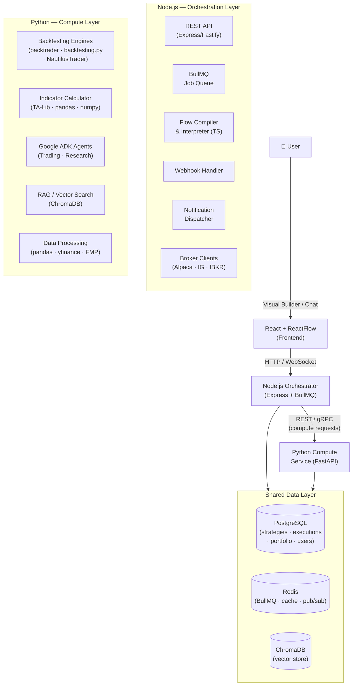
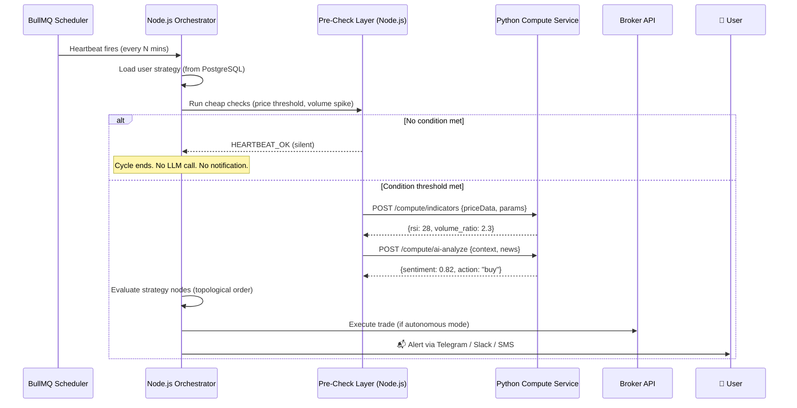
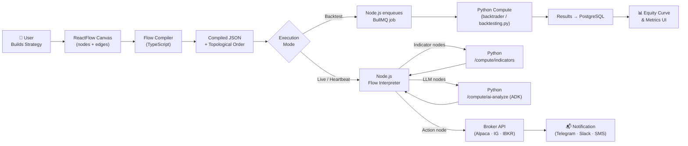
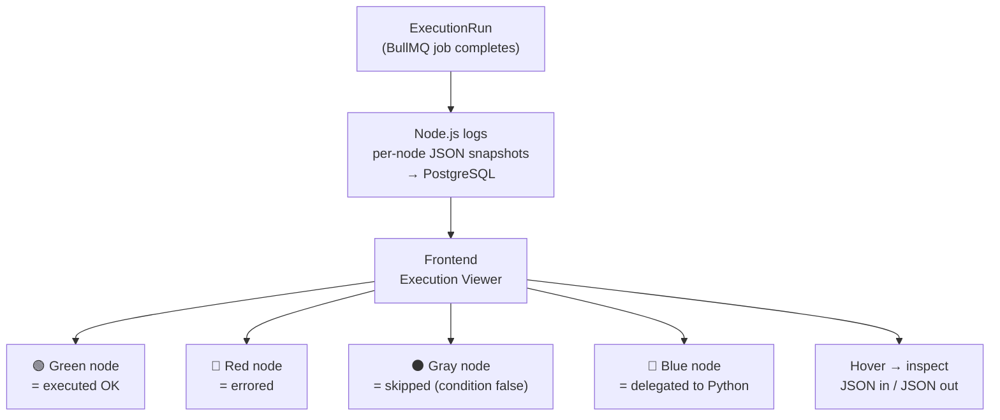
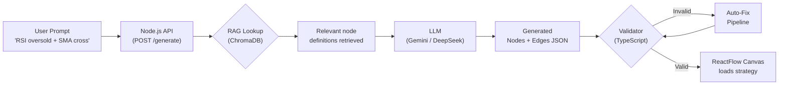

# Project Prometheus (PPM) — StrategyFlow

**Project Prometheus** is an advanced AI-powered algorithmic trading platform that lets users build, backtest, and autonomously execute trading strategies through a visual node-and-edge builder. Inspired by **n8n**'s workflow automation and **OpenClaw**'s heartbeat daemon, the platform is evolving into a 24/7 autonomous financial AI agent.


---

## 🚀 Key Features

- **🎨 Visual Strategy Builder** — ReactFlow-based node-and-edge canvas. 10 node categories: Indicators, Conditions, Actions, Environment, Control, Math, Risk, Variables, Trade Info, LLM.
- **🤖 AI Strategy Generation** — Describe strategies in plain English. Gemini/DeepSeek generates the complete node graph via RAG.
- **💬 AI Chat Assistant** — Google ADK agents with 15+ tools for market research, sentiment analysis, and live trading control.
- **📉 Multi-Engine Backtesting** — backtrader, backtesting.py, NautilusTrader. Full metrics: Sharpe, Sortino, CAGR, Drawdown, Win Rate.
- **⚡ Live Trading** — IG Markets and Nordnet broker integrations.
- **⏰ Autonomous Heartbeat Agent** *(upcoming)* — BullMQ-powered background agent that monitors markets 24/7, inspired by OpenClaw.
- **🔗 Webhook Triggers** *(upcoming)* — Event-driven workflow execution, TradingView alert integration.
- **📋 Execution History** *(upcoming)* — Visual debugger for past workflow runs, n8n-style per-node data inspection.

---

## 🏗️ Architecture

### System Overview



---

### Heartbeat Agent Pipeline (OpenClaw-Inspired)



---

### Strategy Execution Pipeline



---

### n8n-Style Execution History



---

### AI Strategy Generation Pipeline



---

## 🛠️ Technology Stack

| Layer | Technology | Role |
|---|---|---|
| **Frontend** | React 18 + Vite + TypeScript | Visual strategy builder UI |
| **UI Components** | Shadcn UI + Tailwind CSS | Design system |
| **Canvas** | ReactFlow (`@xyflow/react`) | Node-and-edge graph editor |
| **State** | Zustand | Client state management |
| **Orchestrator** | Bun + Express | API server, workflow orchestration |
| **Job Queue** | BullMQ + Redis | Heartbeat scheduling, async jobs |
| **Compute Service** | Python + FastAPI | Backtesting, indicators, AI agents |
| **Backtesting** | backtrader, backtesting.py, NautilusTrader | Strategy backtesting engines |
| **AI Orchestration** | Google ADK + Gemini | Autonomous trading agents |
| **LLM Providers** | Google Gemini + DeepSeek | Strategy generation + analysis |
| **RAG** | ChromaDB + vector_rag | Block retrieval for AI generation |
| **Data** | pandas, numpy, TA-Lib, yfinance, FMP | Market data processing |
| **Database** | PostgreSQL (prod) / SQLite (dev) | Primary data store |
| **Cache / Events** | Redis | BullMQ broker, pub/sub, caching |

---

## 📦 Installation & Setup

### Prerequisites

- Git
- [Bun](https://bun.sh/) v1.0+
- [Conda](https://docs.conda.io/en/latest/miniconda.html) (Miniconda or Anaconda) with Python 3.12
- [Docker](https://www.docker.com/) & Docker Compose (for Docker method)
- Redis (for local method)
- PostgreSQL 16 (for local method)

### Clone the Repository

```bash
git clone git@github.com:sinatooor/project-prometheus.git
cd project-prometheus
```

### Environment Variables

```bash
cp .env.example .env
# Edit .env and fill in your API keys:
#   DEEPSEEK_API_KEY   — https://platform.deepseek.com/
#   GEMINI_API_KEY     — https://aistudio.google.com/
#   IG_API_KEY/USER/PW — https://labs.ig.com/ (optional, for live trading)

cp backend/.env.example backend/.env
# Add the same LLM keys + any broker keys
```

---

### Method 1: Docker (Recommended)

Docker Compose starts all five services (backend, orchestrator, frontend, PostgreSQL, Redis) in one command.

#### 1. Build and start

```bash
# Core services (backend + orchestrator + postgres + redis)
docker-compose up --build

# Include the frontend dev server
docker-compose --profile frontend up --build

# Run in detached mode
docker-compose up -d --build
```

#### 2. Verify services are healthy

```bash
docker-compose ps

# Test health endpoints
curl http://localhost:8000/health   # Backend (FastAPI)
curl http://localhost:3000/health   # Orchestrator (Bun/Express)
```

#### 3. Stop

```bash
docker-compose down

# Stop and remove volumes (full reset)
docker-compose down -v
```

#### Docker services overview

| Container | Service | Port | Description |
|-----------|---------|------|-------------|
| `openqwnt-backend` | backend | 8000 | Python FastAPI — AI agents, backtesting, indicators |
| `openqwnt-orchestrator` | orchestrator | 3000 | Bun/Express — API server, BullMQ workflows |
| `openqwnt-frontend` | frontend | 5173 | React/Vite dev server (profile: `frontend`) |
| `openqwnt-postgres` | postgres | 5432 | PostgreSQL 16 — primary database |
| `openqwnt-redis` | redis | 6379 | Redis 7 — BullMQ broker, caching |

---

### Method 2: Local Development (Conda)

Run each service individually for faster iteration and debugging.

#### 1. Backend — Python Compute Service (Conda)

```bash
# Create the conda environment (one-time setup)
conda create -n openqwnt python=3.12 -c conda-forge -y
conda activate openqwnt

# Install dependencies
cd backend
pip install -r requirements.txt

# Copy and configure environment
cp .env.example .env
# Edit .env — add GEMINI_API_KEY, DEEPSEEK_API_KEY, etc.
```

> **Note:** TA-Lib requires the C library. Install it first:
> - macOS: `brew install ta-lib`
> - Ubuntu/Debian: `sudo apt-get install libta-lib-dev`
> - Or build from source: https://github.com/TA-Lib/ta-lib/releases

#### 2. Orchestrator — Node.js/Bun

```bash
cd orchestrator
bun install

# Configure environment
cp .env.example .env
# Edit .env — set DATABASE_URL, REDIS_HOST, etc.

# Generate Prisma client and run migrations
bunx prisma generate
bunx prisma migrate dev
```

#### 3. Frontend — React/Vite

```bash
# From the project root
bun install
```

#### 4. Infrastructure — PostgreSQL & Redis

```bash
# Option A: Use Docker for just the databases
docker run -d --name openqwnt-postgres -p 5432:5432 \
  -e POSTGRES_USER=postgres -e POSTGRES_PASSWORD=postgres -e POSTGRES_DB=strategyflow \
  postgres:16-alpine

docker run -d --name openqwnt-redis -p 6379:6379 redis:7-alpine

# Option B: Install and run natively
# macOS:
brew install postgresql@16 redis
brew services start postgresql@16
brew services start redis

# Ubuntu:
sudo apt-get install postgresql redis-server
sudo systemctl start postgresql redis
```

#### 5. Start all services (4 terminals)

```bash
# Terminal 1 — Redis (skip if using Docker or brew services)
redis-server

# Terminal 2 — Python Backend
cd backend && conda activate openqwnt && uvicorn main:app --reload --port 8000

# Terminal 3 — Node.js Orchestrator
cd orchestrator && bun run dev

# Terminal 4 — React Frontend
bun run dev
```

#### Service URLs

| Service | URL | Description |
|---------|-----|-------------|
| Frontend | http://localhost:5173 | React UI |
| Orchestrator | http://localhost:3000 | Bun API + WebSocket server |
| Backend API | http://localhost:8000/docs | FastAPI Swagger (compute layer) |
| PostgreSQL | localhost:5432 | Database (user: `postgres`, pass: `postgres`) |
| Redis | localhost:6379 | BullMQ broker & cache |

---

## 🤖 ADK Trading Agent Tools

| Category | Tools |
|---|---|
| **Market Research** | `search_market_news`, `search_sentiment`, `search_economic_calendar`, `get_market_news` |
| **Web Research** | `scrape_url_text` |
| **Custom Indicators** | `create_custom_indicator`, `update`, `delete`, `list`, `get` |
| **Broker** | `execute_trade`, `get_positions`, `close_position`, `get_account_info`, `get_market_price` |
| **RAG** | `find_similar_blocks`, `get_block_info`, `list_block_categories` |
| **Risk & Strategy** | `run_monte_carlo_simulation`, `calculate_position_sizing`, `calculate_risk_metrics`, `calculate_correlation_matrix` |
| **Analysis** | `scan_candlestick_patterns`, `classify_market_regime` |
| **Memory** | `save_note`, `read_note`, `list_notes`, `append_to_note` |
| **Control** | `update_strategy_risk_settings`, `adjust_trade_size`, `emergency_stop_strategy` |

---

## 🧪 Testing Suite

| Test Suite | Command | Description |
|---|---|---|
| **E2E Test** | `python tests/e2e_test.py` | Full flow: AI Gen → Nodes → Backtest → Result |
| **Stress Test** | `python tests/stress_test.py` | 20 distinct scenarios for stability |
| **Benchmark** | `python tests/benchmark_test.py` | Validates against ground truth data |

---

## 📁 Project Structure

```
openqwnt/
├── src/                          # React Frontend
│   └── features/strategy-flow/  # ReactFlow strategy builder
│       ├── catalog/              # Node definitions by category
│       ├── components/           # Node visual components, panels
│       ├── generators/           # Python code generators
│       ├── store/                # Zustand state (strategyFlowStore.ts)
│       └── types.ts              # TypeScript node/edge types
├── backend/                      # Python Compute Service (FastAPI)
│   ├── adk_agents/               # Google ADK agents + tools
│   ├── flow/                     # Flow compiler + runtime
│   ├── strategy_flow/            # Strategy API router, backtrader engine
│   ├── routers/                  # FastAPI route sets
│   └── main.py                   # FastAPI entry point
├── prd/                          # Product Requirements Documents
│   └── StrategyFlow_PRD_v3.md    # Current PRD (Node.js + Python arch)
├── docker-compose.yml            # Full stack Docker setup
└── CHANGELOG.md                  # Version history
```

---

## 📄 License

Distributed under the MIT License.

---

## 🤝 Contributing

1. Fork the Project
2. Create your Feature Branch (`git checkout -b feature/AmazingFeature`)
3. Commit your Changes (`git commit -m 'Add some AmazingFeature'`)
4. Push to the Branch (`git push origin feature/AmazingFeature`)
5. Open a Pull Request


good prompot " check folder /prd and then check if everything is build for the app, if not continue building    
   till it is done, it does not matter how much it takes or how many api calls, You can now begin   
   implementation.                                                                                  
   Follow the task tree.                                                                            
   After completing each module, summarize:                                                         
   - What you built                                                                                 
   - Tests run                                                                                      
                                                                                                    
   use commit and new branches when needed  "

   test@example.com
   test@example.com