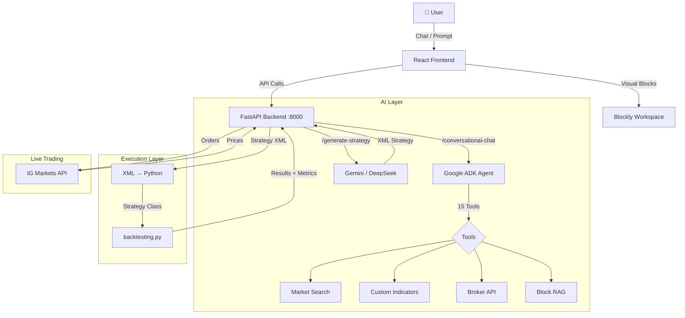
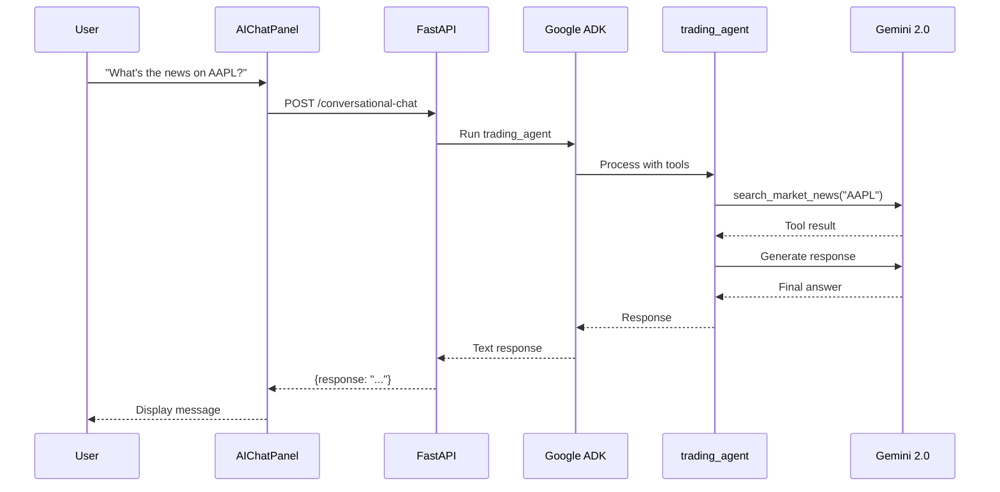
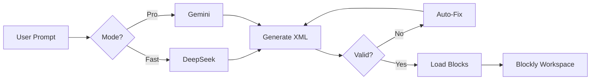

# Project Prometheus (PPM)

**Project Prometheus** is an advanced AI-powered algorithmic trading platform that democratizes strategy creation. It combines a visual drag-and-drop interface (Blockly) with a powerful Generative AI engine (Google Gemini/DeepSeek + RAG + Google ADK) to allow users to create, backtest, and deploy trading strategies using natural language or visual blocks.


## 🚀 Key Features

*   **🤖 AI Strategy Generation**: Describe your strategy in plain English (e.g., *"Buy EURUSD when RSI < 30 and price is above SMA 200"*). The system uses **RAG (Retrieval Augmented Generation)** and **Gemini/DeepSeek** to construct a valid visual strategy.
*   **💬 AI Chat Assistant**: Powered by **Google ADK (Agent Development Kit)** with 15+ tools for market research, custom indicators, and live trading.
*   **🧩 Visual Builder**: Powered by Google Blockly. Modify AI-generated strategies or build from scratch using typed, validating blocks for Indicators, Logic, and Trade Actions.
*   **📉 Robust Backtesting**:
    *   Integrated Python `backtesting.py` engine.
    *   Supports historical data via `yfinance` and Alpha Vantage.
    *   Detailed metrics: CAGR, Sharpe, Sortino, Drawdown, and Win Rate.
*   **⚡ Live Trading**: Direct integration with **IG Markets API** for real-time execution.
*   **🛡️ Auto-Validation**: Strategies are validated for logic errors and Risk Management rules.

## 🛠️ Technology Stack

### Frontend
*   **Framework**: React 18 + Vite
*   **Language**: TypeScript
*   **UI Components**: ShadCn UI + Tailwind CSS
*   **Visual Engine**: Google Blockly (Custom blocks for Trading)
*   **Code Generation**: MQL5 Generator (frontend-side)

### Backend
*   **Server**: Python FastAPI
*   **AI Orchestrator**: Google ADK (Agent Development Kit)
*   **AI Models**: Google Gemini (`gemini-2.0-flash`) + DeepSeek Chat
*   **Data/Analysis**: `pandas`, `numpy`, `yfinance`, `backtesting`

## 📦 Installation & Setup

### Prerequisites
*   Node.js v18+
*   Python 3.10+
*   Git

### 1. Clone the Repository
```bash
git clone git@github.com:sinatooor/project-prometheus.git
cd project-prometheus
```

### 2. Frontend Setup
```bash
npm install
npm run dev
```
Access the UI at `http://localhost:8080`.

### 3. Backend Setup
```bash
cd backend
python -m venv venv
source venv/bin/activate  # Windows: venv\Scripts\activate
pip install -r requirements.txt

# Configure Environment
cp .env.example .env
# Edit .env and add:
#   GEMINI_API_KEY=your_key
#   DEEPSEEK_API_KEY=your_key (optional)
```

### 4. Running Services
```bash
# Terminal 1: FastAPI Backend
uvicorn main:app --reload --port 8000

# Terminal 2: ADK Web UI (optional)
adk web --port 8085
```

| Service | URL | Description |
|---------|-----|-------------|
| Frontend | http://localhost:8080 | React UI |
| Backend API | http://localhost:8000/docs | FastAPI Swagger |
| ADK Web UI | http://localhost:8085 | Google ADK Agent Testing |

## 🏗️ Architecture



## 🔄 AI Chat Pipeline



## 🎯 Strategy Generation Pipeline



## 🤖 ADK Trading Agent

The AI chat uses Google ADK with a `trading_agent` that has access to:

| Tool Category | Tools | Description |
|---------------|-------|-------------|
| **Market Research** | `search_market_news`, `search_sentiment`, `search_economic_calendar` | Real-time market data |
| **Indicators** | `create_custom_indicator`, `update`, `delete`, `list`, `get` | Custom indicator CRUD |
| **Broker** | `execute_trade`, `get_positions`, `close_position`, `get_account_info`, `get_market_price` | IG Markets integration |
| **RAG** | `find_similar_blocks`, `get_block_info`, `list_block_categories` | Block discovery |

## 🧪 Testing Suite

| Test Suite | Command | Description |
|:---|:---|:---|
| **E2E Test** | `python tests/e2e_test.py` | Full flow: AI Gen → XML → Backtest → Result |
| **Stress Test** | `python tests/stress_test.py` | 20 distinct scenarios for stability |
| **Benchmark** | `python tests/benchmark_test.py` | Validates against ground truth data |

## 🤝 Contributing
1.  Fork the Project
2.  Create your Feature Branch (`git checkout -b feature/AmazingFeature`)
3.  Commit your Changes (`git commit -m 'Add some AmazingFeature'`)
4.  Push to the Branch (`git push origin feature/AmazingFeature`)
5.  Open a Pull Request

## 📄 License
Distributed under the MIT License. See `LICENSE` for more information.

