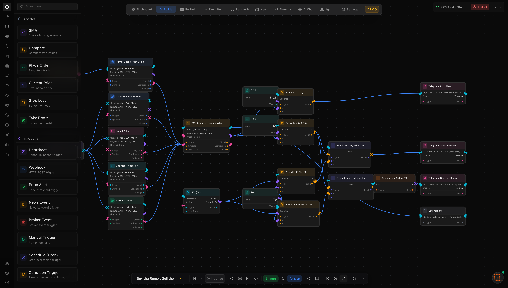
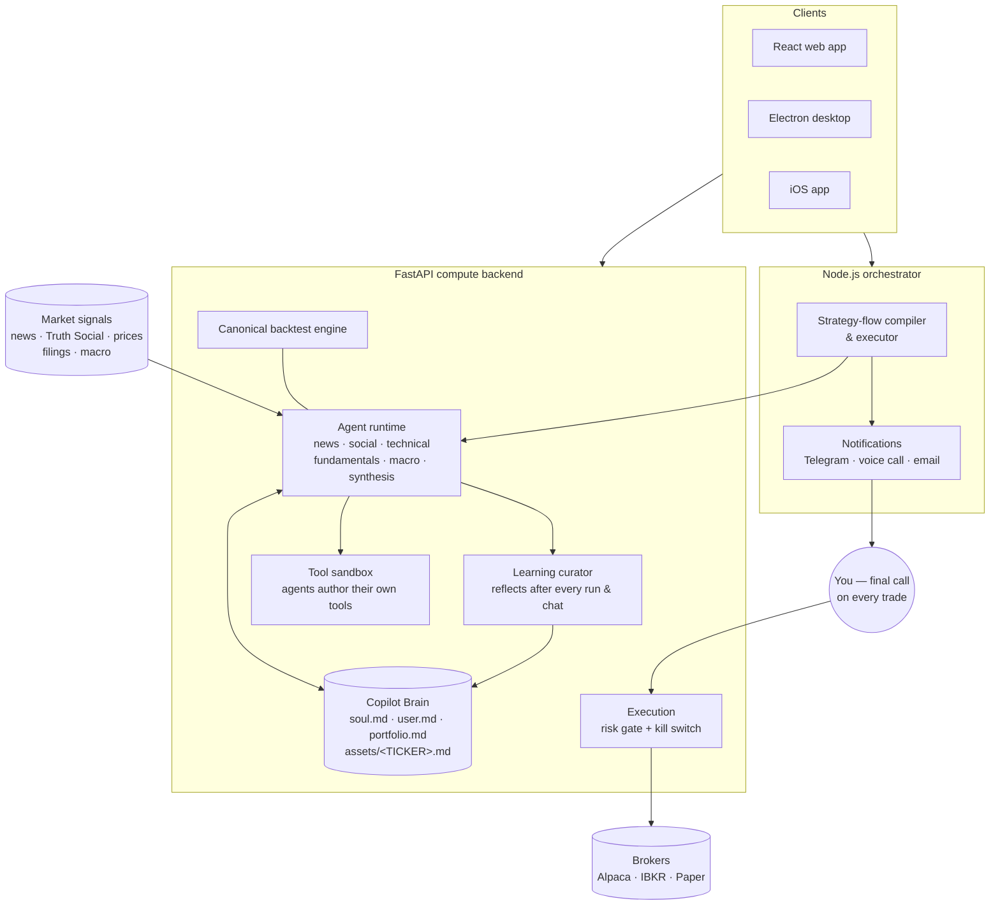

<div align="center">

# OpenQnt

**The world's first open, source-available agentic asset manager — full transparency, full control.**

Wall Street runs on closed black boxes. OpenQnt is the opposite: an autonomous
AI asset-management team whose every agent, every prompt, and every decision
path is code you can read, edit, and own. Visually snap together strategies,
let AI agents research and stress-test them 24/7, backtest against a canonical
engine, and route orders to paper or live brokers — with a kill switch, a risk
gate, and a copilot that **learns your portfolio over time**.


-orange)

</div>

> [!WARNING]
> **Trading involves substantial risk of loss.** OpenQnt is software only and
> does **not** provide financial advice. Paper-trade first. You alone are
> responsible for every order it places and for your regulatory compliance.
> Past performance never guarantees future results.

---

## What is OpenQnt?

Manual trading forces one brain to juggle thousands of news articles, policy
shifts, whale movements, and technical signals — under pressure, and with
research living in a different tool than execution. OpenQnt collapses that into
a single agentic platform:

- **🧩 Visual Strategy Builder** — a drag-and-drop, n8n-style canvas. Fuse
  indicators, conditions, actions, and AI agents into a strategy without
  writing code.
- **🤖 Agentic research** — a hierarchical "boss" dispatches specialist agents
  (news, social/political, technical, fundamentals, macro, synthesis) that pull
  market data, debate a thesis, and even **author their own tools** in a
  sandbox. Every agent you drop on the canvas is live-monitored on the Agents
  page — its thoughts, tool calls, and run history in the open.
- **🧠 A quant copilot that gets better with time** — the AI Quant keeps a
  persistent, human-readable memory brain (`soul.md`, `user.md`,
  `portfolio.md`, one note per asset you hold or watch). After **every** run
  and every chat, a learning phase reflects on what happened and updates what
  it knows — about AAPL, about your book, about *you*. It compounds knowledge
  like a real analyst, and you can open and edit every memory file it keeps.
  Powered by frontier LLMs (Claude, Gemini, GPT — provider-pluggable).
- **📈 Canonical backtest engine** — every strategy runs through one deterministic
  engine (built on `backtesting.py`), so a human and an agent get byte-for-byte
  identical numbers, with an equity/drawdown chart out of the box.
- **⚡ Paper & live execution** — a broker abstraction over a built-in PaperBroker,
  **Alpaca**, and **Interactive Brokers (TWS/Gateway)**, gated by a risk engine
  and a hard kill switch (`panic.lock`).
- **🔁 Self-improvement loop** — mutates strategy parameters, re-backtests, and
  keeps the survivors — demonstrating the core value of AI in quant.
- **🖥️ Bloomberg-style terminal** — real-data screens (DES, GIP, HDS, RMAP, …)
  behind a ⌘K command palette.

It runs in the browser, as a **desktop app** (Electron), and the whole thing is
Docker-composable.

---

## Featured template: "Buy the Rumor, Sell the News"

One click in the strategy builder deploys an entire trading desk that works
the oldest playbook on the street — around the clock, on **your** portfolio:



- **Rumor Desk** reads the raw **Truth Social feed** — policy rumors move
  markets before journalists finish typing.
- **News Momentum Desk + Social Pulse** measure whether the story is still a
  rumor or already front-page news.
- **The Chartist** checks if the move is already priced in (RSI, volume) —
  buying a story the market has already bought is exit liquidity.
- **Valuation Desk** asks whether the story changes fair value at all.
- **The PM (synthesis agent)** weighs all five desks and issues a verdict
  with an explicit confidence score.

Then it **messages you on Telegram** with one of three verdicts:

| Verdict | What it tells you |
| --- | --- |
| 🟢 **Buy-the-rumor candidate** | High-conviction story with room to run — plus an explicit **speculation budget (≤2% of portfolio)** and the risk you're taking |
| 🟡 **Sell-the-news warning** | The story is bullish but already priced in (RSI > 70) — late chasers historically provide the exit |
| 🔴 **Portfolio risk alert** | Bearish confluence across desks on your holdings, with de-risk options |

**It never trades on its own.** The graph deliberately contains no order
node — it presents the data, quantifies the risk, and *you* make the final
call. Every agent in the template appears live on the Agents page, and the
graph ships with automated integrity tests — every node, edge, and handle is
validated by the template test suite.

---

## Quick start

Three flavours — pick the one that matches your environment.

### A. Local (no Docker)

```bash
# 1. Configure your keys (all optional — the app degrades gracefully)
cp .env.example .env         # then fill in what you have

# 2. Backend (Python 3.12)
cd backend
pip install -r requirements.txt
uvicorn main:app --port 8000

# 3. Frontend (in a second terminal)
npm install
npm run dev                  # http://localhost:5173
```

Or use the bundled launcher (override the interpreter with `FYER_PY=...`):

```bash
scripts/start-all.sh paper        # PaperBroker (no broker creds needed)
scripts/start-all.sh ibkr         # routes orders to TWS on 127.0.0.1:7497
scripts/start-all.sh alpaca       # needs ALPACA_API_{KEY,SECRET}
```

### B. Docker

| Goal | Command | Services up |
| --- | --- | --- |
| Agents + backtest engine + dashboards | `make docker-up` | `backend` (8000) + `frontend` (5173) |
| Same + the visual builder's compile/execute path | `make docker-full-up` | adds `orchestrator` (3000) + `postgres` + `redis` |
| Closer-to-prod build (frontend on :80, no source mounts) | `make docker-prod-up` | `backend` + `frontend` (nginx) |

```bash
make docker-up           # minimal — most users want this
make docker-full-up      # everything (the n8n-style stack + agents)
make docker-logs         # tail logs
make docker-down         # stop (named volumes preserved)
```

**IBKR from inside the container:** TWS / IB Gateway runs on the *host*, the
backend in the *container*. Compose maps `host.docker.internal:7497`. Set
`EXECUTION_BROKER=ibkr` in `.env` and probe it:

```bash
echo 'EXECUTION_BROKER=ibkr' >> .env && make docker-up
curl localhost:8000/api/execution/broker/probe   # → {"broker":"ibkr",...}
```

### C. Desktop app

```bash
npm run electron:dev          # dev (Vite + Electron, hot reload)
npm run electron:dist         # packaged desktop app in release/
```

---

## Pages

Mounted under `/` once the frontend is running:

```
/                  Strategy Flow canvas (visual builder)
/backtest          Backtest panel (canonical engine)
/execution         Live paper / Alpaca / IBKR execution
/improvement       Self-improvement loop
/tools             Sandbox + agent-authored tool registry
/boss              Boss-run tree
/terminal/{des,gip,hds,rmap,splc,bmap}   Bloomberg-style screens
/dashboard         Widget canvas (Telemetry + Agent Activity)
```

---

## Architecture

### High-level design



The loop that makes it feel alive: agents read market signals **through** the
memory brain (so they already know your book), act, and then the learning
curator writes back what was worth remembering — so the next run starts
smarter than the last.

### Runtime detail

```
                   ┌─────────────────────────┐
                   │  React + Vite frontend  │
                   │  (browser or Electron)  │
                   └────────────┬────────────┘
                                │ REST + WebSocket
                                ▼
        ┌───────────────────────────────────────────────┐
        │           FastAPI backend (uvicorn)            │
        │                                                │
        │  routers/         /api/{backtest, execution,   │
        │                        improvement, tools,     │
        │                        terminal_data, boss,…}  │
        │  agent_runtime/   AgentRunContext + EventBus    │
        │  backtest/        canonical engine             │
        │  execution/       PaperBroker, Alpaca, IBKR,   │
        │                   RiskGate, kill switch        │
        │  improvement/     Objective / Mutator / Tree   │
        │  sandbox/         subprocess + setrlimit       │
        │  dynamic_tools/   agent-authored tools         │
        │  adk_agents/      Google ADK agents + tools    │
        └───────────────────────┬────────────────────────┘
                                │
                                ▼
              On-disk under  agents/   (per-user state, gitignored)
                ├── boss/runs/<run_id>/     boss + improvement trees
                ├── _backtests/<run_id>/    engine artefacts
                ├── _execution/<session>/   order journal + panic.lock
                └── tools/dynamic/          agent-authored Python tools
```

The Node.js **orchestrator** (`orchestrator/`) powers the visual builder's
compile/execute path and legacy broker connectors. The Python backend (agent
runtime, backtest engine, sandbox, execution, self-improvement) is independent
of it — you only need the orchestrator for the full visual-builder stack.

### One gesture, end to end

```
click "Run backtest" on /backtest
  → POST /api/backtest/run
    → backend/backtest/engine.py:run_backtest(spec)
        → backtesting.py runs the strategy over the bars
        → equity/drawdown PNG rendered, result.json persisted
    → response carries inline plot + metrics + trades
  → the panel renders the chart from the data URL
```

The **same** `run_backtest()` backs the agent tool
(`adk_agents/tools/backtest_tools.py`), so an agent reports identical numbers.

---

## Configuration

Copy `.env.example` → `.env` and fill in what you have. Everything is optional;
missing keys degrade gracefully (e.g. no `GEMINI_API_KEY` → heuristic fallback,
no broker creds → PaperBroker). Highlights:

| Var | Used for | Default |
| --- | --- | --- |
| `EXECUTION_BROKER` | Force a broker (`paper` / `ibkr` / `alpaca`) | infer → `paper` |
| `ALPACA_API_KEY` / `ALPACA_API_SECRET` | Live/paper Alpaca | unset → PaperBroker |
| `IB_HOST` / `IB_PORT` / `IB_CLIENT_ID` | TWS / IB Gateway | `127.0.0.1` / `7497` / `42` |
| `GEMINI_API_KEY` | Boss, synthesis, LLM mutator | unset → heuristic |
| `PAPER_CASH` | Paper starting cash + risk baseline | `100000` |
| `RISK_MAX_ORDER_QTY` | Hard order-size cap | `1000` |
| `RISK_MAX_DRAWDOWN_PCT` | Halt vs peak equity | `20` |
| `RISK_MAX_DAILY_LOSS_PCT` | Halt vs day-open equity | `5` |
| `FMP_API_KEY` | Terminal fundamentals + peers | optional |
| `VITE_MAPBOX_TOKEN` | Map screens (BMAP/RMAP) | optional |

> **Never commit your `.env`.** It is gitignored. Rotate any key you think may
> have been exposed.

---

## Extending it

**Add an agent** — subclass `BaseAnalysisAgent`
(`backend/adk_agents/base_agent.py`), give it a system prompt + tools, and
return a structured `AgentOutput`. Telemetry is wired automatically; register it
in `backend/routers/boss.py` so the boss can dispatch it.

**Add a node to the visual builder** — four pieces:
1. Catalogue entry in `src/features/strategy-flow/catalog/nodeCatalog.ts`
2. Backend mirror in `backend/strategy_flow/node_catalog_cache.json`
3. Renderer (if it needs custom UI) under `src/features/strategy-flow/components/nodes/`
4. Backtest behaviour in `backend/backtest/builtins.py`

---

## Tests

```bash
# Backend (pytest)
cd backend && pytest tests/ -q
#   test_backtest_reference.py   canonical engine (SMA 50/200 on SPY, pinned)
#   test_rsi_template.py         template + validator
#   test_dynamic_tools.py        sandbox + tool authoring
#   test_execution.py            paper broker + risk gate
#   test_improvement.py          self-improvement loop

# Frontend
npm test                 # vitest (unit)
npm run e2e              # Playwright (needs backend on :8000 + chromium)
```

CI (`.github/workflows/ci.yml`) runs lint + typecheck + vitest + pytest on every PR.

---

## Repository layout

```
backend/          FastAPI app — agents, backtest, execution, improvement, sandbox
src/              React frontend — strategy-flow, backtest, execution, terminal, …
orchestrator/     Node.js workflow engine for the visual builder + legacy brokers
electron/         desktop app shell
e2e/              Playwright specs
docs/             architecture, data-provider, and how-to-run notes
scripts/          start-all.sh and helpers
```

---

## Roadmap

A functional MVP exists today: visual builder, canonical backtesting, agentic
research, paper/live execution against Alpaca + IBKR, and a working
self-improvement loop. Next up: broader broker coverage, richer terminal
screens, and per-institution custom workflows.

---

## License

**OpenQnt is source-available, not open source.** It is licensed under the
[OpenQnt Community License (OQCL) v1.0](LICENSE) — free for personal,
educational, research, and internal-evaluation use. **Commercial and production
use requires a Commercial License.** See the [LICENSE](LICENSE) for the full
terms, and contact **s_i_n_a@icloud.com** for commercial licensing.

**Sina Rajaeeian is the sole and exclusive owner of OpenQnt and all related
intellectual property** — copyrights, patents, trademarks, and trade secrets,
worldwide. All rights reserved. The license grants a limited right to use; it
transfers no ownership.

By contributing, you agree to the contribution terms in the LICENSE.

---

## Author

**Sina Rajaeeian** — Founder & sole developer.
Double M.Sc. at KTH Royal Institute of Technology (Industrial Engineering &
Management + Machine Learning), building at the intersection of AI/ML,
full-stack, and quantitative finance.
