# openqwnt — architecture

This document is the architectural reference for the platform as it
exists at the end of Phase J (see [PLAN.md](../PLAN.md) and the
`PHASE_*_RESULT.md` files at the repo root). It supersedes the
pre-Phase-B "Project Prometheus" doc that lived here previously — that
text described a Node-orchestrator era that no longer matches the
shipped surface.

If you only read one diagram, read [§ 1](#1-system-overview).
If you want to understand a single user gesture, jump to
[§ 9 Sequence diagrams](#9-sequence-diagrams).

---

## 1. System overview

The platform is a thin React/Vite frontend talking to a FastAPI
backend that owns every piece of state. State persists under
`agents/` on disk; the database used elsewhere in the repo
(PostgreSQL, Redis) is **not** on the Phase-B-onwards critical path.

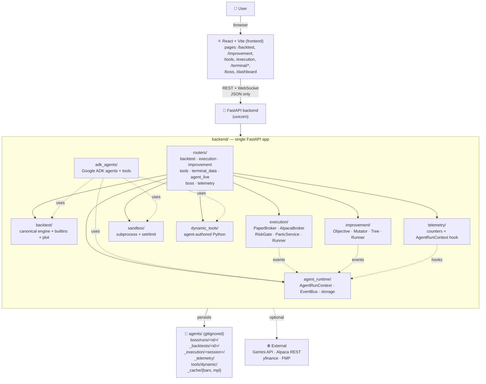

Two subsystems on the diagram are dotted because they can run without
external services: the boss + improvement loop fall back to a
heuristic when `GEMINI_API_KEY` is unset, and execution falls back to
`PaperBroker` when Alpaca creds are unset.

---

## 2. Frontend page map

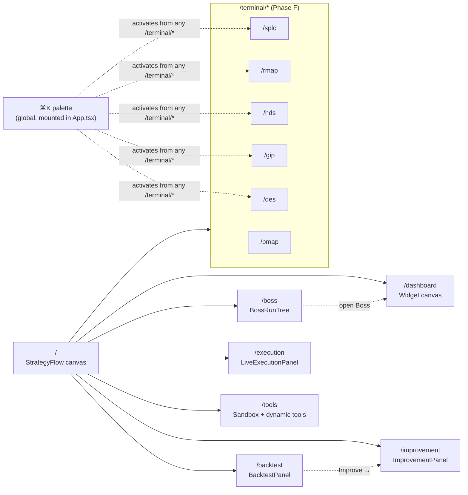

The cmd+K palette is mounted once at the App level
([`SymbolPalette.tsx`](../src/features/terminal/SymbolPalette.tsx))
and works on any non-strategy-flow page. URL `:ticker` and the global
[`terminalSymbolStore`](../src/stores/terminalSymbolStore.ts) are
synced both directions by every `/terminal/*` page.

---

## 3. Phase B — agent runtime

Every agent run holds an `AgentRunContext`. It's the only thing an
agent uses to talk to the runtime. Each method appends to disk
(durable) **and** publishes to the in-process `EventBus` (which the
WebSocket router fans out to live subscribers).

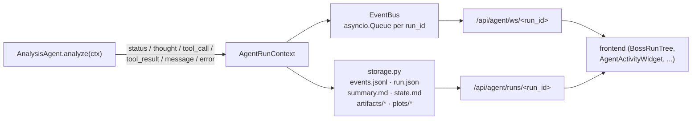

Tool calls use a context-manager so the `tool_call` (pending) and
`tool_result` (success/error) are paired automatically:

```python
with ctx.tool_call("backtest.run", {"symbol": "SPY", ...}) as h:
    result = run_backtest(spec)
    h.result(f"sharpe={result.metrics['sharpe']:.2f}")
```

---

## 4. Phase D — canonical backtest engine

One module, one entrypoint. The frontend `/backtest` page, every
agent `run_backtest_tool` invocation, and the Phase I improvement
loop all call the same `run_backtest(spec)` and get the same shape
back, byte-for-byte identical for identical inputs.

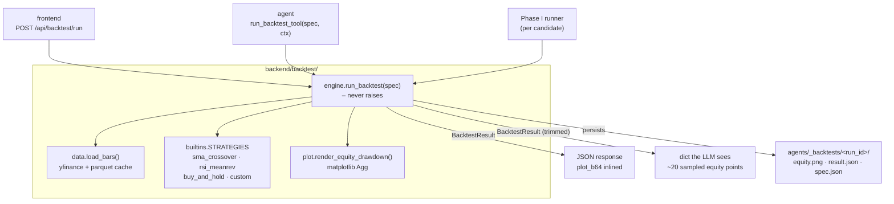

The Phase D guarantee — that REST and agent return identical numbers
for the same `BacktestSpec` — is locked down by
`backend/tests/test_rsi_template.py::test_template_backtest_runs_canonical`
and the SMA reference test
`tests/test_backtest_reference.py`.

---

## 5. Phase F — terminal data routing

Every `/terminal/*` screen has the same render-instantly-then-upgrade
shape: deterministic mock fallback in JS, real data via
`terminalApiGet → /api/terminal/<screen>/<ticker>`, merged so empty
sections never blank the layout.

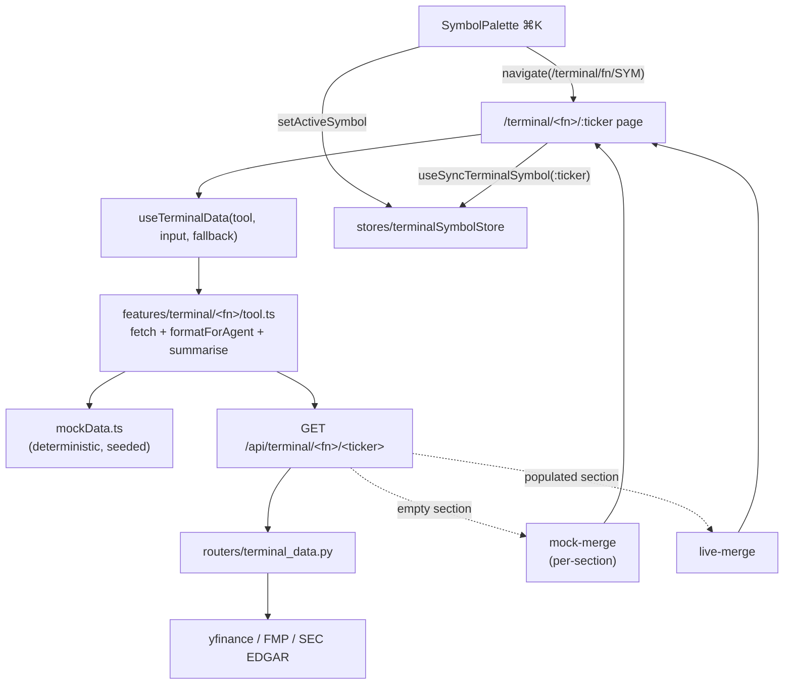

Six screens × one shape. Adding a screen = drop a `tool.ts` +
`mockData.ts` + a backend `/api/terminal/<x>/<ticker>` route.

---

## 6. Phase G — sandbox + dynamic tools

Two layers: a generic Python subprocess sandbox and a registry that
lets agents author *new* Python tools at runtime.

```mermaid
graph TD
    agent["agent (boss / synthesis / dev)"]
    create["create_dynamic_tool(name, code)"]
    call["call_dynamic_tool(name, kwargs)"]
    valid["_validate_module<br/>(ast checks + sandbox import probe)"]
    registry["agents/tools/dynamic/&lt;name&gt;.py<br/>+ _index.json"]
    sb["sandbox.execute_python<br/>(subprocess + setrlimit + tmpdir)"]
    rest["POST /api/tools/dynamic<br/>POST /api/tools/dynamic/&lt;name&gt;/call<br/>POST /api/tools/sandbox/execute"]
    ui["/tools page<br/>catalogue + playground + author"]

    ui --> rest
    agent --> create
    agent --> call
    create --> valid
    valid -->|"ok"| registry
    valid -->|"sandbox probe"| sb
    call --> registry
    call --> sb
    rest --> create
    rest --> call
    rest --> sb
```

Every tool call — generated or built-in — runs in a fresh tmpdir as
`python -I main.py` with `RLIMIT_CPU`, `RLIMIT_FSIZE`, `RLIMIT_AS`
applied via `preexec_fn`. The backend never imports agent-authored
code into its own process.

---

## 7. Phase H — live execution path

One verb (`runner.submit_signal`) gates every order through
`RiskGate` before it reaches the broker. Every order — allowed or
rejected — is journalled. The kill switch is file-backed so it
survives a backend restart.

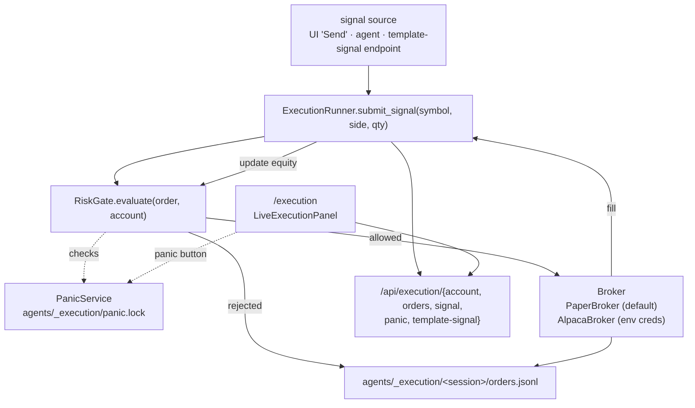

Six gate rules, evaluated in order: panic → halt-state → max_order_qty
→ max_position_notional → drawdown vs peak → daily loss vs day-open.
First failure stops evaluation and rejects.

---

## 8. Phase I — self-improvement loop

`ImprovementRunner` walks a search tree centred on the *current best*
node, scores every candidate with `Objective` (Sharpe with a max-DD
brake + a no-trade floor), and re-evaluates the winner on a held-out
window.

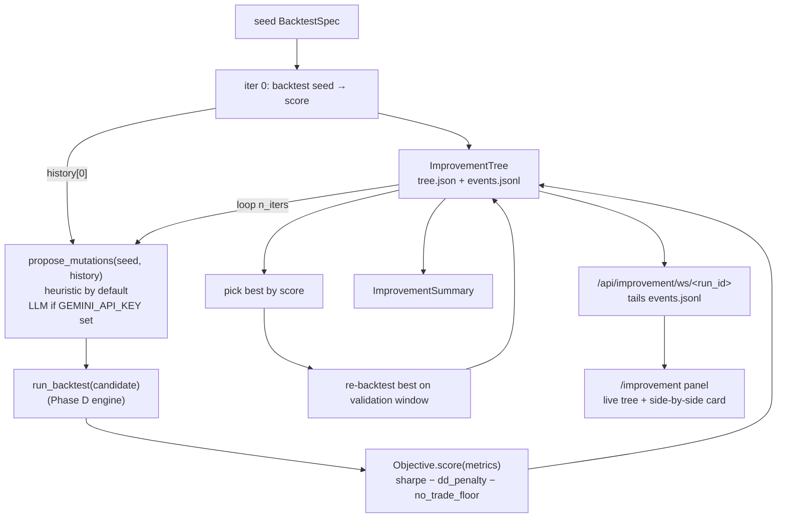

`/backtest`'s **Improve →** button pre-seeds the form via querystring
so the user goes from "I just ran a backtest" to "I'm watching it
self-tune" in one click.

---

## 9. Sequence diagrams

### 9.1 Run a backtest from the UI

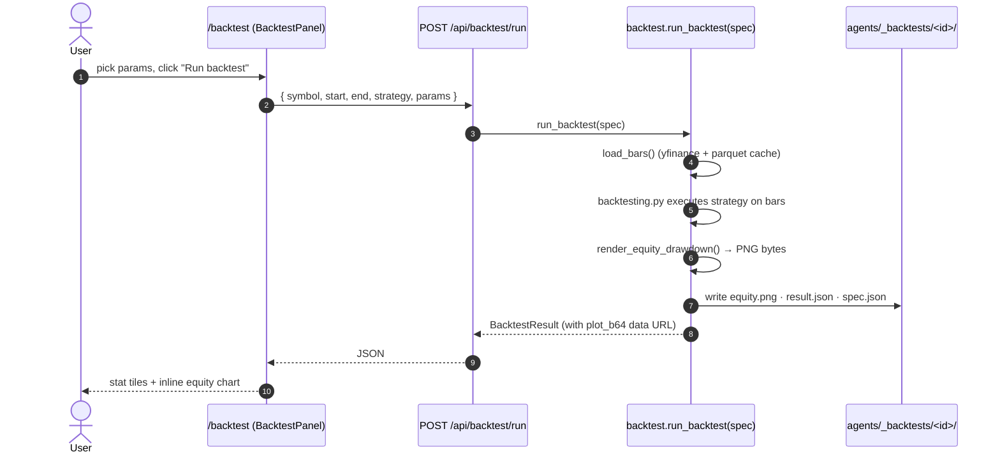

### 9.2 Agent runs a tool that emits events live

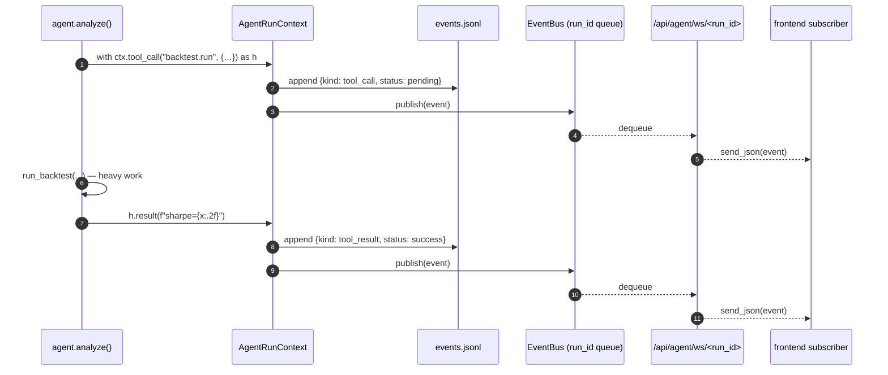

### 9.3 Self-improvement loop end-to-end

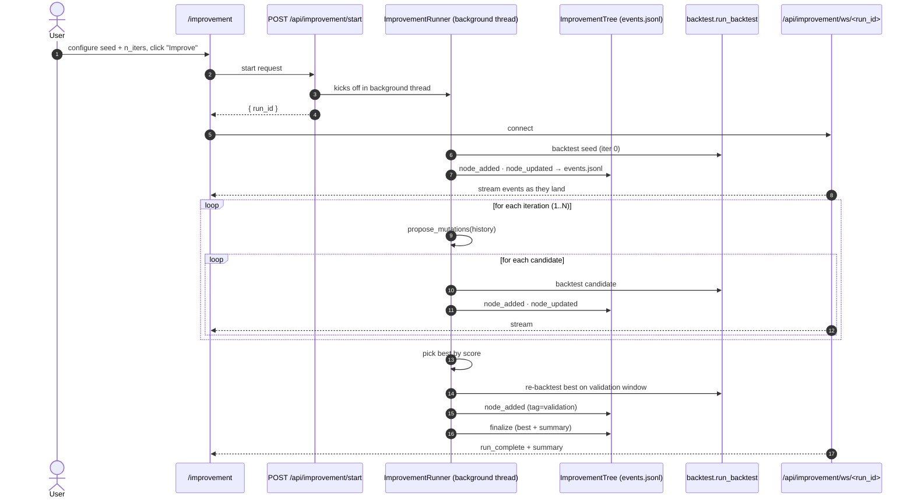

### 9.4 Paper order from signal to journal

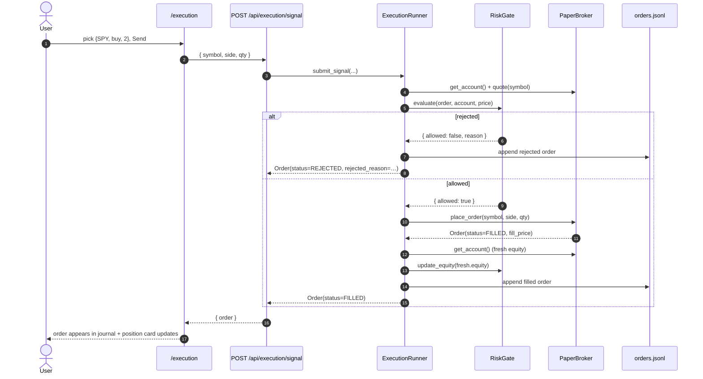

---

## 10. Phase J — telemetry, CI, E2E

```mermaid
graph LR
    AR["AgentRunContext<br/>(every agent uses)"]
    HOOK["telemetry.hook_into_context()<br/>called once at startup"]
    COUNT["telemetry/counters.py<br/>thread-safe + 1s flush"]
    DISK["agents/_telemetry/counters.json"]
    REST["/api/telemetry/{summary, reset}"]
    WIDGET["TelemetryWidget<br/>polls every 5s"]

    AR -.patched at startup.-> HOOK
    HOOK -->|"on __init__/finish/_emit"| COUNT
    COUNT --> DISK
    DISK --> REST
    REST --> WIDGET
```

CI ([`.github/workflows/ci.yml`](../.github/workflows/ci.yml)) runs
two parallel jobs: **frontend** (lint + typecheck-of-Phase-B-I files
+ vitest) and **backend** (Phase D canonical reference + Phase E
template + Phase G dynamic tools + Phase H execution + Phase I
improvement, all pytest).

E2E ([`e2e/phase-e-rsi-template.spec.ts`](../e2e/phase-e-rsi-template.spec.ts))
walks the Phase E flow in Chromium: open `/backtest`, pick
`rsi_meanrev`, run, assert the inlined equity PNG + stat tiles.

---

## 11. On-disk layout

Everything under `agents/` is gitignored — it's per-user state.
Created on demand by the modules that own it.

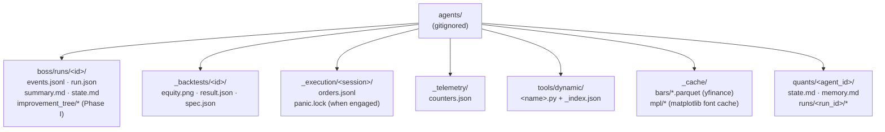

Owners:
- `boss/`, `quants/` — Phase B agent_runtime/storage.py
- `_backtests/` — Phase D backtest/engine.py
- `_execution/` — Phase H execution/runner.py + execution/panic.py
- `_telemetry/` — Phase J telemetry/counters.py
- `tools/dynamic/` — Phase G dynamic_tools/registry.py
- `_cache/bars/` — Phase D backtest/data.py
- `_cache/mpl/` — Phase G sandbox/runner.py (pre-warmed font cache)

---

## 12. Module dependency graph

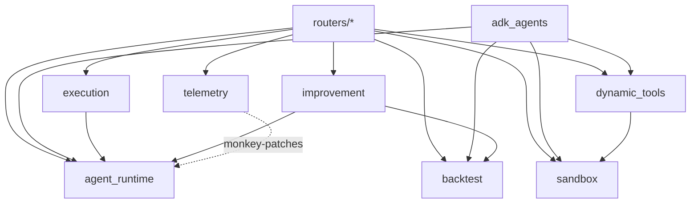

Cycle-free. The agent runtime sits at the bottom because everything
that emits events ultimately writes through `AgentRunContext`. The
canonical backtest engine has no dependency back into the runtime.

---

## 13. Where to look next

| Question | File |
| --- | --- |
| What ships in each phase? | [PLAN.md](../PLAN.md) + `PHASE_*_RESULT.md` at repo root |
| How do I add an agent? | [README.md](../README.md#how-to-add-an-agent) |
| How do I add a node? | [README.md](../README.md#how-to-add-a-node-to-the-visual-builder) |
| How is the canonical engine invoked? | [`backend/backtest/engine.py`](../backend/backtest/engine.py) |
| How does the boss orchestrate? | [`backend/routers/boss.py`](../backend/routers/boss.py) |
| Where do orders journal? | `agents/_execution/<session>/orders.jsonl` (on disk) |
| How does the kill switch work? | [`backend/execution/panic.py`](../backend/execution/panic.py) |
| What does a tool call look like in the stream? | [§ 9.2 above](#92-agent-runs-a-tool-that-emits-events-live) |
