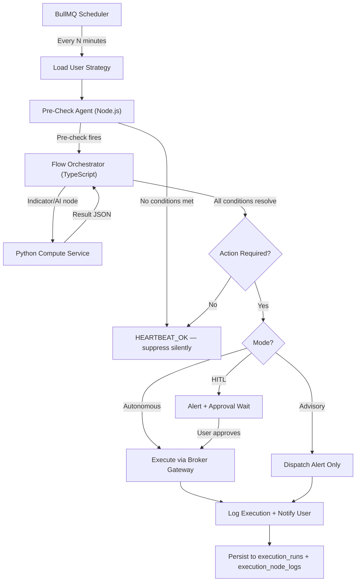
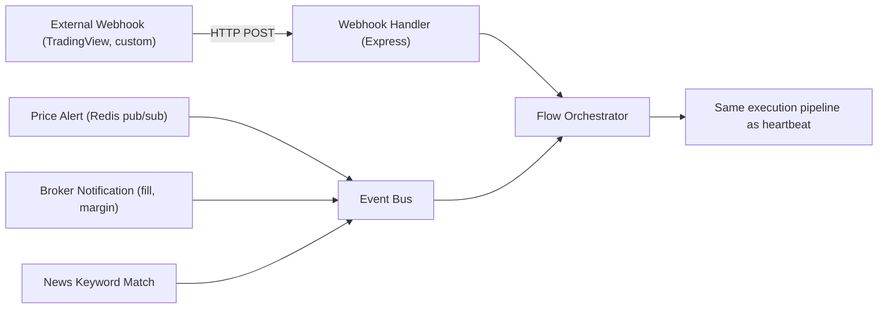
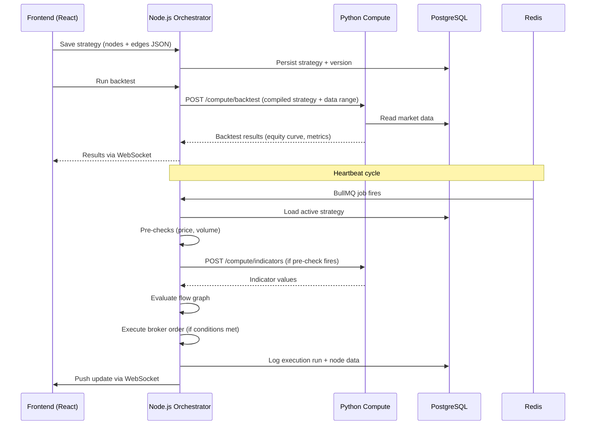
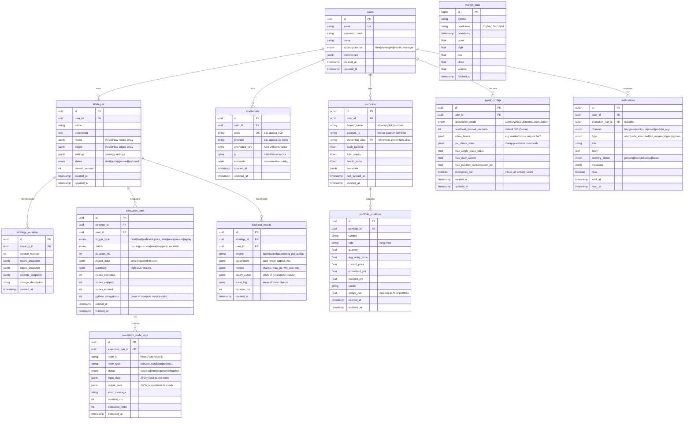

# StrategyFlow AI Agent — Full Spec (5P) & Technical Implementation Plan

---

## Part 1: 5P Framework Spec

---

### 1. Purpose

**Mission:** Transform the existing StrategyFlow visual strategy builder from a passive flowchart tool into a fully autonomous, 24/7 financial AI agent — an "AI hedge fund team in a box" that any individual investor can use.

**Core Value Proposition:**
- **From diagram → executable engine:** The user's flowchart becomes a living, event-driven workflow (n8n-inspired) traversed in real time as market conditions evolve
- **From manual → autonomous:** An OpenClaw-inspired heartbeat daemon monitors markets, reads news, executes trades, and manages risk 24/7 — without requiring the user to be online
- **From institutional → democratized:** Capabilities historically reserved for $500K+/year hedge fund teams (systematic execution, real-time news analysis, portfolio risk management) delivered at $29–$499/month

**What exists today (baseline):**
| Layer | Status |
|---|---|
| Visual strategy builder | ✅ Fully operational (ReactFlow, 10 node categories, 50+ indicators) |
| Flow compiler & runtime | ✅ Working (Python, ~675 lines combined) |
| Backtesting engines | ✅ Working (backtrader, backtesting.py, NautilusTrader) |
| Broker integrations | ✅ IG Markets, Nordnet |
| AI strategy generation | ✅ LLM-powered NL→nodes+edges |
| RAG system | ✅ ChromaDB vector retrieval |
| ADK agents | ✅ Trading, research, developer agents |

**What needs to be built:**
| Capability | Status |
|---|---|
| Node.js orchestrator (BullMQ, Express, WebSocket) | 🆕 New service |
| TypeScript flow compiler + interpreter | 🔄 Port from Python |
| Heartbeat daemon with cheap pre-checks | 🆕 |
| Credential vault (AES-256) | 🆕 |
| Execution history + visual debugging | 🆕 |
| Trigger node category (webhook, price alert, news) | 🆕 |
| Multi-channel notifications (Telegram, Slack, SMS) | 🆕 |
| PostgreSQL migration (from SQLite) | 🔄 |
| Portfolio sync + context engine | 🆕 |
| Additional broker clients (Alpaca, IBKR) | 🆕 |
| Auth + subscription tiers | 🆕 |

---

### 2. People (Virtual Roles / Agents)

These are the functional "agents" (system actors) within the architecture. Each maps to a bounded responsibility.

| Agent / Role | Responsibility | Runs In | Analogous To |
|---|---|---|---|
| **Heartbeat Scheduler** | BullMQ repeatable jobs. Wakes the workflow engine at configurable intervals per user/strategy. Manages the OpenClaw-style daemon loop. | Node.js | n8n's workflow trigger system |
| **Pre-Check Agent** | Performs cheap, non-LLM checks (price thresholds, volume spikes, keyword matches) before escalating to the AI. Suppresses HEARTBEAT_OK non-events. | Node.js | OpenClaw's pre-check layer |
| **Flow Orchestrator** | Compiles strategy graphs, manages topological execution order, routes node data (JSON payloads) through the workflow. Delegates compute-heavy nodes to Python. | Node.js (TypeScript) | n8n's workflow engine |
| **Compute Service** | Handles indicator math (TA-Lib/pandas/numpy), backtesting, AI agent analysis, RAG retrieval, and Python code generation. | Python (FastAPI) | Quant analyst / data scientist |
| **Notification Dispatcher** | Multi-channel outbound: Telegram, Slack, SMS (Twilio), email (SendGrid), push (Firebase). Handles human-in-the-loop approval flows. | Node.js | Communications desk |
| **Broker Gateway** | Manages broker API connections (Alpaca, IG, IBKR, Nordnet). Handles order execution, position sync, portfolio reconciliation. | Node.js | Trade execution desk |
| **Credential Manager** | Encrypts/decrypts API keys (AES-256), manages per-user credential aliases, audit logging. | Node.js | Security/compliance officer |
| **Execution Logger** | Records per-node JSON input/output snapshots for every workflow run. Powers the execution history viewer and replay mode. | Node.js → PostgreSQL | Audit/compliance team |
| **Portfolio Context Engine** | Maintains real-time portfolio state — positions, P&L, sector exposure, correlation matrix. | Node.js + Python | Portfolio analyst |
| **ADK AI Agent Layer** | Google ADK agents for trading decisions, research synthesis, sentiment analysis, and strategy generation. | Python | Senior analyst / PM |

---

### 3. Process (Workflow)

#### 3.1 — Heartbeat Cycle (Primary Loop)



#### 3.2 — Event-Driven Trigger Flow



#### 3.3 — Strategy Lifecycle

```
Build → Validate → Backtest → Simulate → Deploy → Monitor → Alert/Execute → Review
  │         │         │          │          │         │           │              │
Canvas   TS Compiler  Python    Live data,  BullMQ   Heartbeat   Broker API    Execution
(React)  (Node.js)    Backtest  no trades   Jobs     + Triggers  + Notifier    History UI
```

#### 3.4 — Data Flow Between Services



---

### 4. Platform (Stack / Frameworks)

#### Frontend (Keeps As-Is, Extends)
| Technology | Purpose | Status |
|---|---|---|
| React 18 + TypeScript | UI framework | ✅ Existing |
| ReactFlow (`@xyflow/react`) | Canvas — visual node-and-edge builder | ✅ Existing |
| Zustand (persisted) | State management | ✅ Existing |
| Shadcn UI + Radix + Tailwind CSS | Component library + styling | ✅ Existing |
| TanStack Query | Server state | ✅ Existing |
| Lightweight Charts + Recharts | Charts and data viz | ✅ Existing |
| Socket.io Client | Real-time execution updates | 🆕 New |
| Vite | Build tool | ✅ Existing |

#### Node.js Orchestrator (New)
| Technology | Purpose |
|---|---|
| **Express** or **Fastify** | HTTP API + webhook ingestion |
| **TypeScript** | Shared types with frontend (node/edge/data schemas) |
| **BullMQ** | Job scheduling, heartbeat intervals, retries, concurrency control |
| **Socket.io** | WebSocket server for real-time frontend push |
| **Prisma** or **Knex.js** | PostgreSQL ORM/query builder |
| **ioredis** | Redis client (BullMQ transport, caching, pub/sub) |
| **node-telegram-bot-api** | Telegram bot integration |
| **@slack/web-api** | Slack notifications |
| **twilio** | SMS / voice notifications |
| **@sendgrid/mail** | Email notifications |
| **crypto** (built-in) | AES-256 credential encryption |
| **jsonwebtoken + bcrypt** | JWT auth + password hashing |
| **helmet + cors + rate-limit** | Security middleware |
| **bull-board** | BullMQ monitoring dashboard |
| **pino** or **winston** | Structured JSON logging |

#### Python Compute Service (Refactored from Existing)
| Technology | Purpose | Status |
|---|---|---|
| **FastAPI** | Internal-only REST API | ✅ Existing (strips to compute-only) |
| **TA-Lib + pandas + numpy** | Indicator math (50+ indicators) | ✅ Existing |
| **backtrader / backtesting.py** | Backtesting engines | ✅ Existing |
| **NautilusTrader** | Advanced backtesting | ✅ Existing |
| **Google ADK** | AI agent orchestration | ✅ Existing |
| **ChromaDB** | Vector store for RAG | ✅ Existing |
| **SQLAlchemy** | Database ORM for market data tables | ✅ Existing |

#### Shared Data Layer
| Technology | Purpose | Migration |
|---|---|---|
| **PostgreSQL 16** | Primary relational DB | 🔄 Migrate from SQLite |
| **Redis 7** | BullMQ broker + cache + pub/sub | ✅ Exists in Docker Compose (expand role) |
| **ChromaDB** | Vector DB for RAG / agent memory | ✅ Existing |

#### Deployment
| Component | Container |
|---|---|
| Frontend | Nginx (production) / Vite dev server |
| Node.js Orchestrator | `orchestrator` container |
| Python Compute | `compute` container (internal-only, not exposed) |
| PostgreSQL | `postgres` container |
| Redis | `redis` container (already exists) |
| ChromaDB | `chromadb` container (optional) |
| Nginx | Reverse proxy (production) |

---

### 5. Performance (Success Metrics)

#### System Metrics
| Metric | Phase 1 Target | Phase 3+ Target | How Measured |
|---|---|---|---|
| Heartbeat uptime | 99.5% | 99.9% | BullMQ health monitoring + external pinger |
| Signal-to-alert latency | < 60s | < 10s | Timestamp diff: market event → user notification delivered |
| Node.js → Python round-trip | < 200ms (indicators) | < 50ms (gRPC) | Instrumented latency per compute call |
| Backtest execution time | < 30s (1yr data) | < 10s | End-to-end timing of `/compute/backtest` |
| WebSocket delivery | < 500ms | < 100ms | Push-to-receive timestamp |

#### Product Metrics
| Metric | 6mo Target | 12mo Target | How Measured |
|---|---|---|---|
| Strategy execution accuracy | 95% match to flowchart logic | 99% | Execution replay audit vs. expected path |
| User retention (90-day) | 40% | 65% | Cohort analysis |
| Autonomous actions/user/month | 50+ | 200+ | `execution_runs` table aggregation |
| HITL approval rate | > 80% | > 90% | Approved vs. rejected HITL events |

#### Cost Metrics
| Metric | Target | How Measured |
|---|---|---|
| LLM invocations per heartbeat cycle | < 0.1 (90% suppressed by pre-checks) | Counter per cycle |
| Cost per active user/month | < $2 infrastructure | Cloud billing / MAU |
| Pre-check suppression rate | > 85% of heartbeats resolve without Python/LLM | `HEARTBEAT_OK` count / total heartbeats |

---

## Part 2: Technical Implementation Plan

---

### Architecture Overview

```
                    ┌──────────────────────────┐
                    │   React Frontend (Vite)   │
                    │   ReactFlow · Zustand     │
                    │   Socket.io Client        │
                    └─────────┬────────────────┘
                              │ HTTP / WS
                    ┌─────────▼────────────────┐
                    │  Node.js Orchestrator     │
                    │  Express/Fastify + TS     │
                    │  ┌─────────────────────┐  │
                    │  │ BullMQ Workers      │  │
                    │  │ Flow Engine (TS)     │  │
                    │  │ Webhook Handler      │  │
                    │  │ Notification Svc     │  │
                    │  │ Broker Gateway       │  │
                    │  │ Credential Vault     │  │
                    │  │ Auth (JWT)           │  │
                    │  │ WS Server (Socket.io)│  │
                    │  └─────────────────────┘  │
                    └─────────┬────────────────┘
                              │ REST (internal)
                    ┌─────────▼────────────────┐
                    │  Python Compute Service   │
                    │  FastAPI (internal-only)  │
                    │  ┌─────────────────────┐  │
                    │  │ Indicators (TA-Lib)  │  │
                    │  │ Backtesting Engines  │  │
                    │  │ ADK AI Agents        │  │
                    │  │ RAG / ChromaDB       │  │
                    │  │ Code Generation      │  │
                    │  └─────────────────────┘  │
                    └─────────┬────────────────┘
                              │
              ┌───────────────┼───────────────┐
              │               │               │
        ┌─────▼─────┐  ┌─────▼─────┐  ┌──────▼─────┐
        │ PostgreSQL │  │   Redis   │  │  ChromaDB  │
        │ (primary)  │  │ (BullMQ,  │  │ (vectors)  │
        │            │  │  cache,   │  │            │
        │            │  │  pub/sub) │  │            │
        └────────────┘  └───────────┘  └────────────┘
```

---

### API Routes

#### Node.js Orchestrator — Public API

**Auth**
| Method | Route | Description |
|---|---|---|
| `POST` | `/api/auth/register` | Create account |
| `POST` | `/api/auth/login` | Login → JWT |
| `POST` | `/api/auth/refresh` | Refresh token |
| `POST` | `/api/auth/logout` | Invalidate token |

**Strategies**
| Method | Route | Description |
|---|---|---|
| `GET` | `/api/strategies` | List user's strategies |
| `POST` | `/api/strategies` | Create new strategy |
| `GET` | `/api/strategies/:id` | Get strategy with nodes/edges |
| `PUT` | `/api/strategies/:id` | Update strategy (auto-versions) |
| `DELETE` | `/api/strategies/:id` | Soft-delete strategy |
| `POST` | `/api/strategies/:id/compile` | Compile flow graph → execution plan |
| `POST` | `/api/strategies/:id/validate` | Validate flow graph |
| `POST` | `/api/strategies/:id/deploy` | Activate for heartbeat monitoring |
| `POST` | `/api/strategies/:id/pause` | Pause heartbeat |

**Execution**
| Method | Route | Description |
|---|---|---|
| `GET` | `/api/executions` | List execution runs (paginated, filterable) |
| `GET` | `/api/executions/:id` | Get execution with per-node data |
| `POST` | `/api/executions/:id/replay` | Replay a past execution |
| `POST` | `/api/strategies/:id/backtest` | Trigger backtest (→ Python compute) |
| `GET` | `/api/strategies/:id/backtest/:runId` | Get backtest results |

**Portfolio**
| Method | Route | Description |
|---|---|---|
| `GET` | `/api/portfolio` | Get synced portfolio state |
| `POST` | `/api/portfolio/sync` | Force broker sync |
| `GET` | `/api/portfolio/positions` | Current positions with P&L |
| `GET` | `/api/portfolio/health` | Portfolio health score |

**Credentials**
| Method | Route | Description |
|---|---|---|
| `GET` | `/api/credentials` | List credential aliases (no raw keys) |
| `POST` | `/api/credentials` | Store encrypted credential |
| `PUT` | `/api/credentials/:id` | Update credential |
| `DELETE` | `/api/credentials/:id` | Delete credential |

**Agent Config**
| Method | Route | Description |
|---|---|---|
| `GET` | `/api/agent/config` | Get heartbeat config, mode, active hours |
| `PUT` | `/api/agent/config` | Update config |
| `POST` | `/api/agent/kill` | Emergency kill switch — halt all |

**Notifications**
| Method | Route | Description |
|---|---|---|
| `GET` | `/api/notifications` | Notification history |
| `PUT` | `/api/notifications/:id/read` | Mark as read |

**Webhooks (Inbound)**
| Method | Route | Description |
|---|---|---|
| `POST` | `/api/webhooks/:strategyId` | Receive external webhook (TradingView, etc.) |
| `POST` | `/api/webhooks/hitl/:executionId` | Human-in-the-loop approval callback |

**AI Generation**
| Method | Route | Description |
|---|---|---|
| `POST` | `/api/ai/generate-strategy` | NL → nodes+edges (proxied to Python ADK if needed) |
| `POST` | `/api/ai/analyze` | AI analysis of market context |

---

#### Python Compute Service — Internal API (not publicly exposed)

| Method | Route | Description |
|---|---|---|
| `POST` | `/compute/indicators` | Calculate indicator values given price data + params |
| `POST` | `/compute/backtest` | Run full backtest given compiled strategy + data range |
| `POST` | `/compute/ai-analyze` | ADK agent analysis (sentiment, research, trading) |
| `POST` | `/compute/generate-strategy` | NL → nodes+edges (ADK-dependent) |
| `POST` | `/compute/data/process` | Process raw market data via pandas |
| `GET` | `/compute/health` | Health check |

---

### Database Schema (PostgreSQL)

#### Entity Relationship Diagram



---

### Frontend Structure

#### New Pages & Components

```
src/
├── App.tsx                          # Add routes for new pages
├── pages/
│   ├── StrategyFlow.tsx             # ✅ Existing — canvas builder
│   ├── ExecutionDetails.tsx         # ✅ Existing — extend with node data viewer
│   ├── Dashboard.tsx                # 🆕 Portfolio overview + alert feed
│   ├── ExecutionHistory.tsx         # 🆕 n8n-style execution list
│   ├── Credentials.tsx              # 🆕 Credential vault manager
│   ├── AgentConfig.tsx              # 🆕 Heartbeat settings, mode selection
│   ├── Login.tsx                    # 🆕 Auth page
│   └── Settings.tsx                 # 🆕 Account, subscription, preferences
├── features/
│   ├── strategy-flow/               # ✅ Existing — extend with trigger nodes
│   │   ├── components/              # Add trigger node UIs
│   │   ├── catalog/                 # Add trigger + integration node definitions
│   │   └── types.ts                 # Extend with trigger/integration types
│   ├── execution-viewer/            # 🆕 Canvas overlay for execution replay
│   │   ├── ExecutionCanvas.tsx      # Canvas with green/red/gray/blue node coloring
│   │   ├── NodeDataPreview.tsx      # Hover tooltip showing JSON I/O
│   │   └── ExecutionTimeline.tsx    # Timeline scrubber
│   ├── dashboard/                   # 🆕 
│   │   ├── PortfolioSummary.tsx     
│   │   ├── AlertFeed.tsx            
│   │   ├── ActiveStrategies.tsx     
│   │   └── HealthIndicators.tsx     
│   └── notifications/               # 🆕 
│       ├── NotificationCenter.tsx   
│       └── HITLApprovalCard.tsx     
├── services/
│   ├── api.ts                       # 🔄 Repoint from Python to Node.js
│   ├── websocket.ts                 # 🆕 Socket.io client
│   └── auth.ts                      # 🆕 JWT auth helper
├── stores/
│   ├── flowStore.ts                 # ✅ Existing
│   ├── authStore.ts                 # 🆕 
│   ├── executionStore.ts            # 🆕 
│   └── notificationStore.ts        # 🆕 
└── hooks/
    ├── useWebSocket.ts              # 🆕 
    ├── useAuth.ts                   # 🆕 
    └── useExecutionReplay.ts        # 🆕 
```

---

### External Integrations

| Integration | Purpose | Protocol | Phase |
|---|---|---|---|
| **Alpaca Markets** | Stock/crypto trading + paper trading sandbox | REST + WebSocket | Phase 3 |
| **IG Markets** | CFDs, spread betting | REST | ✅ Existing |
| **Nordnet** | Nordic markets | REST | ✅ Existing |
| **Interactive Brokers** | Professional trading | TWS API / REST | Phase 4 |
| **Polygon.io** | Real-time market data | REST + WebSocket | Phase 3 |
| **NewsAPI / RSS** | News ingestion | REST | Phase 3 |
| **OpenAI / Gemini / DeepSeek** | LLM providers | REST | ✅ Existing |
| **Google ADK** | AI agent framework (Python SDK) | In-process | ✅ Existing |
| **Telegram Bot API** | Notifications + HITL approvals | HTTP polling / webhooks | Phase 2 |
| **Slack Web API** | Notifications | REST | Phase 3 |
| **Twilio** | SMS + voice alerts | REST | Phase 3 |
| **SendGrid** | Email notifications | REST | Phase 3 |
| **Firebase Cloud Messaging** | Push notifications | REST | Phase 4 |
| **TradingView** | Webhook alerts (inbound) | Webhook POST | Phase 2 |

---

### Security Considerations

#### Authentication & Authorization
- **JWT tokens** with short-lived access tokens (15min) and refresh tokens (7d)
- **bcrypt** password hashing (cost factor 12)
- Rate limiting on auth endpoints (5 attempts/min)
- CORS whitelist for frontend origin only

#### Credential Vault
- AES-256-GCM encryption for all API keys
- Encryption key stored in environment variable (not in DB)
- Keys **never** logged — only aliases appear in any output
- Per-user isolation — queries always scoped to authenticated user
- Audit log of all credential access events

#### API Security
- **Helmet** security headers on all responses
- Input validation via **Zod** schemas on every endpoint
- SQL injection prevention via Prisma parameterized queries
- Request size limits (1MB default, 10MB for strategy uploads)
- HMAC signature verification on inbound webhooks

#### Broker Security
- OAuth 2.0 for broker connections where available (Alpaca, IBKR)
- Never store user broker passwords — only OAuth tokens / API keys in vault
- All broker API calls logged for compliance audit trail

#### Trading Guardrails (Enforced at Middleware Level — Cannot Be Bypassed by Agent)
- Max single trade value (user-defined cap)
- Max daily spend limit
- Position concentration limits
- Circuit breaker detection — auto-halt during market circuit breakers
- Emergency kill switch — accessible via API, Telegram command (`/stop`), and dashboard button

#### Data & Privacy
- PostgreSQL encryption at rest
- All inter-service communication over internal Docker network (not exposed)
- Python compute service has **no public-facing endpoints**
- GDPR-ready: user data export and account deletion endpoints
- Strategy data is per-user, never shared between users (unless marketplace feature, Phase 4)

---

### Node.js Orchestrator — Directory Structure

```
orchestrator/
├── package.json
├── tsconfig.json
├── prisma/
│   └── schema.prisma              # PostgreSQL schema
├── src/
│   ├── index.ts                   # App entry point
│   ├── config/
│   │   ├── env.ts                 # Environment variables
│   │   └── redis.ts               # Redis/ioredis connection
│   ├── api/
│   │   ├── routes/
│   │   │   ├── auth.ts
│   │   │   ├── strategies.ts
│   │   │   ├── executions.ts
│   │   │   ├── portfolio.ts
│   │   │   ├── credentials.ts
│   │   │   ├── agent.ts
│   │   │   ├── notifications.ts
│   │   │   ├── webhooks.ts
│   │   │   └── ai.ts
│   │   └── middleware/
│   │       ├── auth.ts            # JWT verification
│   │       ├── rateLimit.ts
│   │       └── validate.ts        # Zod schema validation
│   ├── engine/
│   │   ├── compiler.ts            # TS port of flow/compiler.py
│   │   ├── interpreter.ts         # TS port of flow/runtime.py (orchestration only)
│   │   ├── preChecks.ts           # OpenClaw-style cheap checks
│   │   └── types.ts               # Shared types (re-exported to frontend)
│   ├── workers/
│   │   ├── heartbeat.ts           # BullMQ heartbeat worker
│   │   ├── backtest.ts            # Backtest job processor
│   │   └── notification.ts        # Notification dispatch worker
│   ├── services/
│   │   ├── computeClient.ts       # HTTP client to Python service
│   │   ├── brokerGateway.ts       # Broker API abstraction
│   │   ├── credentialVault.ts     # AES-256 encrypt/decrypt
│   │   ├── notificationService.ts # Multi-channel dispatch
│   │   ├── portfolioService.ts    # Portfolio sync + health
│   │   └── websocketService.ts    # Socket.io server
│   ├── brokers/
│   │   ├── alpaca.ts
│   │   ├── ig.ts
│   │   ├── ibkr.ts
│   │   └── nordnet.ts
│   └── utils/
│       ├── logger.ts              # Pino structured logging
│       └── crypto.ts              # Encryption helpers
└── tests/
    ├── engine/
    │   ├── compiler.test.ts
    │   └── interpreter.test.ts
    ├── services/
    └── api/
```

---

### Phased Delivery Plan

| Phase | Duration | Key Deliverables | Dependencies |
|---|---|---|---|
| **1 — Foundation** | Weeks 1–8 | Node.js scaffold (Express + BullMQ + Prisma), PostgreSQL schema + migration, TS flow compiler port, basic heartbeat, frontend → Node.js API migration | None |
| **2 — Workflow Engine** | Weeks 9–16 | TS flow interpreter, trigger nodes (heartbeat/webhook/price alert), execution history backend + visual debugger, credential vault, Telegram notifications, advisory mode | Phase 1 |
| **3 — Intelligence** | Weeks 17–26 | Python compute integration (indicators, backtesting, AI), news ingestion + sentiment, Alpaca paper trading, live execution + guardrails, HITL node, multi-channel notifications | Phase 2 |
| **4 — Scale** | Weeks 27–36 | Autonomous mode, multi-portfolio, walk-forward/Monte Carlo, strategy marketplace, WebSocket real-time, mobile responsive, auth + subscription tiers | Phase 3 |

---

### Verification Plan

Since this is a planning/spec document (no code changes), verification consists of:

1. **User review** of the 5P Spec and Technical Implementation Plan for completeness and correctness
2. **Confirmation** that the architecture, API routes, and DB schema align with the PRD v3.0 requirements
3. **Approval** to begin Phase 1 implementation

No automated tests are applicable at this stage — tests will be defined per-phase during implementation.
