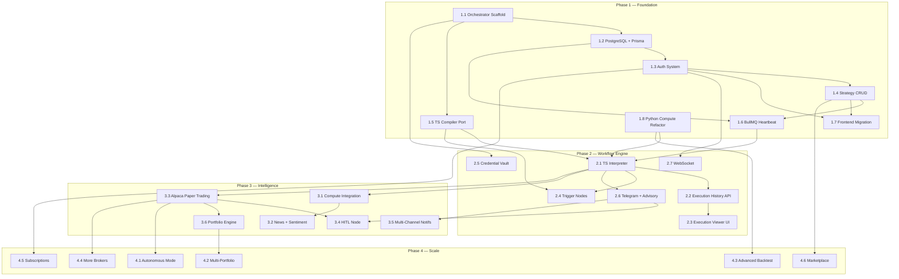

# StrategyFlow AI Agent — Complete Task Tree

**Legend:** `[ ]` Not started · `[/]` In progress · `[x]` Complete · `⛔` Blocked · `DEP:` Dependency

---

## Phase 1 — Foundation (Weeks 1–8)

### Milestone 1.1: Node.js Orchestrator Scaffold
> **Goal:** Bootable Express + TypeScript project with health check, linting, and Docker container.

| # | Task | Tools / Skills | Acceptance Criteria | DEP |
|---|---|---|---|---|
| 1.1.1 | Initialize `orchestrator/` project with `npm init`, TypeScript config, ESLint, Prettier | Node.js, TypeScript, npm | `npx tsc` compiles cleanly; `npm run dev` starts with no errors | — |
| 1.1.2 | Set up Express server with health endpoint (`GET /health`) | Express, TypeScript | `curl localhost:3000/health` returns `{ status: "ok" }` | 1.1.1 |
| 1.1.3 | Add Pino structured JSON logging | Pino | All requests logged with request ID, method, path, duration | 1.1.2 |
| 1.1.4 | Add security middleware (helmet, cors, rate-limit) | helmet, cors, express-rate-limit | Security headers present in responses; CORS rejects unknown origins | 1.1.2 |
| 1.1.5 | Add Zod-based request validation middleware | Zod | Invalid payloads return 400 with structured error messages | 1.1.2 |
| 1.1.6 | Configure Docker container (Dockerfile + docker-compose service) | Docker | `docker-compose up orchestrator` starts the service; health check passes | 1.1.2 |
| 1.1.7 | Set up Vitest (or Jest) test runner with first smoke test | Vitest/Jest | `npm test` runs and passes ≥1 test | 1.1.1 |

---

### Milestone 1.2: PostgreSQL Schema & Data Layer
> **Goal:** Full Prisma schema matching the ER diagram; dev DB running with all migrations applied.

| # | Task | Tools / Skills | Acceptance Criteria | DEP |
|---|---|---|---|---|
| 1.2.1 | Add PostgreSQL service to `docker-compose.yml` | Docker, PostgreSQL | `docker-compose up postgres` starts; `psql` connects successfully | — |
| 1.2.2 | Install Prisma; write `schema.prisma` with all 12 tables | Prisma, PostgreSQL | `npx prisma validate` passes; schema matches ER diagram from spec | 1.1.1, 1.2.1 |
| 1.2.3 | Generate and apply initial migration | Prisma Migrate | `npx prisma migrate dev` succeeds; all tables exist in DB | 1.2.2 |
| 1.2.4 | Write seed script with test data (1 user, 1 strategy, 1 credential) | Prisma, TypeScript | `npx prisma db seed` populates test data; query returns seeded rows | 1.2.3 |
| 1.2.5 | Configure Redis connection (ioredis) for BullMQ and caching | ioredis, Redis | Redis ping succeeds; basic set/get works | 1.1.1 |

---

### Milestone 1.3: Authentication System
> **Goal:** JWT-based auth with register, login, refresh, and protected route middleware.

| # | Task | Tools / Skills | Acceptance Criteria | DEP |
|---|---|---|---|---|
| 1.3.1 | Implement `POST /api/auth/register` (bcrypt hashing, Prisma insert) | bcrypt, Prisma, Zod | Creates user; password stored as bcrypt hash; returns JWT pair | 1.2.3 |
| 1.3.2 | Implement `POST /api/auth/login` (verify password, issue JWT) | jsonwebtoken, bcrypt | Correct credentials return 200 + tokens; wrong credentials return 401 | 1.3.1 |
| 1.3.3 | Implement `POST /api/auth/refresh` (validate refresh token, issue new access token) | jsonwebtoken | Expired access token fails; valid refresh token returns new access token | 1.3.2 |
| 1.3.4 | Build `authMiddleware` (verify JWT, attach `req.user`) | jsonwebtoken | Protected routes return 401 without token; 200 with valid token | 1.3.2 |
| 1.3.5 | Implement `POST /api/auth/logout` (invalidate refresh token) | Redis or DB | Logout invalidates token; subsequent refresh fails | 1.3.3 |
| 1.3.6 | Write auth integration tests (register → login → access → refresh → logout) | Vitest, Supertest | All 5 auth flows pass in CI | 1.3.5 |

---

### Milestone 1.4: Strategy CRUD API
> **Goal:** Full strategy lifecycle endpoints connected to PostgreSQL with auto-versioning.

| # | Task | Tools / Skills | Acceptance Criteria | DEP |
|---|---|---|---|---|
| 1.4.1 | Implement `POST /api/strategies` (create with nodes/edges JSON) | Prisma, Zod | Strategy created in DB; returns UUID; version = 1 | 1.3.4 |
| 1.4.2 | Implement `GET /api/strategies` (list user's strategies, paginated) | Prisma | Returns array of strategies for authenticated user only; pagination works | 1.4.1 |
| 1.4.3 | Implement `GET /api/strategies/:id` (full strategy with nodes/edges) | Prisma | Returns strategy JSON matching ReactFlow format; 404 for non-existent | 1.4.1 |
| 1.4.4 | Implement `PUT /api/strategies/:id` (update + auto-create version) | Prisma (transaction) | Updates strategy; creates row in `strategy_versions`; increments version number | 1.4.1 |
| 1.4.5 | Implement `DELETE /api/strategies/:id` (soft-delete: status → archived) | Prisma | Strategy status set to "archived"; still in DB but excluded from list | 1.4.1 |
| 1.4.6 | Write strategy CRUD tests | Vitest, Supertest | Create, read, update, delete, list — all pass; version history verified | 1.4.5 |

---

### Milestone 1.5: TypeScript Flow Compiler Port
> **Goal:** 1:1 port of `flow/compiler.py` (240 lines) to TypeScript with shared types.

| # | Task | Tools / Skills | Acceptance Criteria | DEP |
|---|---|---|---|---|
| 1.5.1 | Define shared TypeScript types (`FlowNode`, `FlowEdge`, `ValidationResult`, `CompilationResult`) matching Python dataclasses | TypeScript | Types match Python dataclasses exactly; exportable from `engine/types.ts` | 1.1.1 |
| 1.5.2 | Port `_topological_sort` (Kahn's algorithm) | TypeScript, graph algorithms | Topological order matches Python output for ≥3 test graphs; cycle detection works | 1.5.1 |
| 1.5.3 | Port `_resolve_port_type` and `_is_type_compatible` (type checking) | TypeScript | All type compatibility rules match Python behavior (signal↔boolean, any wildcard) | 1.5.1 |
| 1.5.4 | Port `validate_flow_strategy` (full validation pipeline) | TypeScript | Validates: required nodes, type mismatches, missing inputs, cycles. Matches Python output for ≥5 test strategies | 1.5.2, 1.5.3 |
| 1.5.5 | Port `compile_flow_strategy` (compilation pipeline) | TypeScript | Compiles strategy → JSON output with `node_order`, `inputs`, `indicator_defs`. Output matches Python for same input | 1.5.4 |
| 1.5.6 | Implement `POST /api/strategies/:id/compile` and `POST /api/strategies/:id/validate` API routes | Express, TypeScript | API returns compilation/validation results; matches Python backend output | 1.5.5, 1.4.1 |
| 1.5.7 | Write compiler unit tests (≥10 test cases covering all node categories) | Vitest | All tests pass; parity with Python `backend/flow/compiler.py` verified | 1.5.5 |

---

### Milestone 1.6: BullMQ Heartbeat Scheduler
> **Goal:** Basic repeatable job scheduler that fires heartbeat events per active strategy.

| # | Task | Tools / Skills | Acceptance Criteria | DEP |
|---|---|---|---|---|
| 1.6.1 | Set up BullMQ queue and connection factory | BullMQ, ioredis | Queue connects to Redis; can enqueue and dequeue a test job | 1.2.5 |
| 1.6.2 | Implement heartbeat worker that loads active strategies from DB on each tick | BullMQ, Prisma | Worker fires at configured interval; loads strategies with `status: "active"` | 1.6.1, 1.4.1 |
| 1.6.3 | Implement `POST /api/strategies/:id/deploy` (create BullMQ repeatable job) | BullMQ, Express | Deploying a strategy creates a repeatable job; verifiable in Bull Board | 1.6.2 |
| 1.6.4 | Implement `POST /api/strategies/:id/pause` (remove repeatable job) | BullMQ | Pausing removes the job from queue; heartbeat stops firing | 1.6.3 |
| 1.6.5 | Add Bull Board dashboard at `/admin/queues` | @bull-board/express | Dashboard accessible; shows active, completed, and failed jobs | 1.6.1 |
| 1.6.6 | Write heartbeat scheduler tests (deploy, fire, pause, retry on failure) | Vitest, BullMQ | Jobs fire at expected intervals; pause stops them; failed jobs retry with backoff | 1.6.4 |

---

### Milestone 1.7: Frontend API Migration
> **Goal:** React frontend connects to Node.js orchestrator instead of Python FastAPI for strategy CRUD.

| # | Task | Tools / Skills | Acceptance Criteria | DEP |
|---|---|---|---|---|
| 1.7.1 | Update `src/services/api.ts` — repoint base URL to Node.js orchestrator | React, TypeScript | All API calls go to `http://localhost:3000/api` | 1.4.6 |
| 1.7.2 | Add `src/services/auth.ts` — JWT storage, auto-refresh, attach to requests | React, JWT | Token stored in memory/httpOnly cookie; auto-refreshes before expiry | 1.3.6 |
| 1.7.3 | Create `Login.tsx` page and `authStore.ts` (Zustand) | React, Zustand, Shadcn UI | Login form works; redirects to canvas on success; shows error on failure | 1.7.2 |
| 1.7.4 | Add auth guard to routes (redirect to login if not authenticated) | React Router | Unauthenticated users see login page; authenticated users see canvas | 1.7.3 |
| 1.7.5 | Update `StrategyFlow.tsx` to load/save strategies via Node.js API | React, TanStack Query | Strategies persist to PostgreSQL; reload shows saved state | 1.7.1 |
| 1.7.6 | Verify full round-trip: login → create strategy → save → reload → edit → save | Manual + E2E | Strategy flow works end-to-end with new backend | 1.7.5 |

---

### Milestone 1.8: Python Compute Service Refactor
> **Goal:** Strip Python FastAPI to internal-only compute endpoints; remove user-facing routes.

| # | Task | Tools / Skills | Acceptance Criteria | DEP |
|---|---|---|---|---|
| 1.8.1 | Create compute-only FastAPI app with health endpoint | FastAPI, Python | `GET /compute/health` returns 200; no user-facing routes | — |
| 1.8.2 | Implement `POST /compute/indicators` (price data + params → indicator values) | TA-Lib, pandas, numpy | Returns correct SMA/EMA/RSI values for test data; matches existing `IndicatorRegistry` | 1.8.1 |
| 1.8.3 | Implement `POST /compute/backtest` (compiled strategy + data range → results) | backtrader, backtesting.py | Returns equity curve, trade log, metrics for a test strategy | 1.8.1 |
| 1.8.4 | Implement `POST /compute/ai-analyze` (context → ADK agent analysis) | Google ADK, Python | Returns structured analysis JSON from ADK trading agent | 1.8.1 |
| 1.8.5 | Update Docker Compose: Python service is internal-only (no exposed ports) | Docker | Python container not reachable from host; only reachable from `orchestrator` on Docker network | 1.8.1, 1.1.6 |
| 1.8.6 | Build `computeClient.ts` in Node.js (HTTP client to Python service) | Axios/fetch, TypeScript | Node.js can call `/compute/indicators` and receive valid response | 1.8.2, 1.1.2 |

---

## Phase 2 — Workflow Engine & Triggers (Weeks 9–16)

### Milestone 2.1: TypeScript Flow Interpreter
> **Goal:** Port the `FlowInterpreter` evaluation loop to TypeScript; delegates compute-heavy nodes to Python.

| # | Task | Tools / Skills | Acceptance Criteria | DEP |
|---|---|---|---|---|
| 2.1.1 | Port `FlowInterpreter._resolve_value` and `_get_inputs` | TypeScript | Correctly resolves node input values from prior outputs | 1.5.5 |
| 2.1.2 | Port node evaluation logic for non-compute nodes (conditions, control, math, variables, environment, actions) | TypeScript | All non-compute node types evaluate correctly; matches Python behavior | 2.1.1 |
| 2.1.3 | Implement Python-delegated evaluation for indicator and LLM nodes (via `computeClient`) | TypeScript, HTTP | Indicator nodes send request to Python, receive values, continue graph | 2.1.2, 1.8.6 |
| 2.1.4 | Implement `ExecutionRun` and `ExecutionNodeLog` recording during evaluation | Prisma, TypeScript | Every node produces a log entry with input/output JSON and status | 2.1.2 |
| 2.1.5 | Implement pre-check agent (cheap threshold checks before full graph evaluation) | TypeScript | Heartbeat cycles with no threshold breaches resolve as HEARTBEAT_OK without Python calls | 2.1.2, 1.6.2 |
| 2.1.6 | Integration test: full heartbeat cycle (schedule → pre-check → evaluate → log) | Vitest, BullMQ | End-to-end heartbeat cycle completes and produces correct execution log | 2.1.5 |

---

### Milestone 2.2: Execution History Backend
> **Goal:** API endpoints for querying and inspecting past workflow executions.

| # | Task | Tools / Skills | Acceptance Criteria | DEP |
|---|---|---|---|---|
| 2.2.1 | Implement `GET /api/executions` (paginated, filterable by strategy/status/date) | Prisma, Express | Returns paginated list with total count; filters work correctly | 2.1.4 |
| 2.2.2 | Implement `GET /api/executions/:id` (full execution with per-node logs) | Prisma | Returns execution run + array of node logs with input/output JSON | 2.2.1 |
| 2.2.3 | Implement `POST /api/executions/:id/replay` (re-run with same or modified params) | BullMQ, TypeScript | Creates new execution run marked as `trigger_type: "replay"` | 2.2.2 |

---

### Milestone 2.3: Execution History Frontend (Visual Debugger)
> **Goal:** n8n-style visual execution viewer — canvas overlay with color-coded nodes and data preview.

| # | Task | Tools / Skills | Acceptance Criteria | DEP |
|---|---|---|---|---|
| 2.3.1 | Create `ExecutionHistory.tsx` page (list of past executions with status badges) | React, Shadcn UI, TanStack Query | Page lists executions; each shows trigger type, status, duration, timestamp | 2.2.1, 1.7.1 |
| 2.3.2 | Create `ExecutionCanvas.tsx` (ReactFlow canvas with color-coded nodes) | ReactFlow, TypeScript | Nodes colored: green=success, red=error, gray=skipped, blue=delegated | 2.3.1 |
| 2.3.3 | Create `NodeDataPreview.tsx` (hover tooltip showing JSON I/O per node) | React, Shadcn Popover | Hovering over a node shows `input_data` and `output_data` JSON | 2.3.2 |
| 2.3.4 | Create `ExecutionTimeline.tsx` (timeline scrubber showing execution order) | React, CSS | Timeline shows nodes in execution order with duration bars | 2.3.2 |
| 2.3.5 | Add replay button → triggers `POST /api/executions/:id/replay` | React, TanStack Query | Clicking replay starts new execution; updates list | 2.2.3, 2.3.1 |

---

### Milestone 2.4: Trigger Node Category
> **Goal:** New node type category in the visual builder for event-driven triggers.

| # | Task | Tools / Skills | Acceptance Criteria | DEP |
|---|---|---|---|---|
| 2.4.1 | Define trigger node types in shared types (`HeartbeatTrigger`, `WebhookTrigger`, `PriceAlertTrigger`, `NewsTrigger`, `BrokerEventTrigger`) | TypeScript | Types exported; usable in both frontend catalog and backend engine | 1.5.1 |
| 2.4.2 | Add trigger nodes to frontend catalog (drag-and-drop in sidebar) | React, ReactFlow | Trigger nodes appear in sidebar under "Triggers" category; draggable onto canvas | 2.4.1 |
| 2.4.3 | Build trigger node UI components (config panels for interval, URL, thresholds) | React, Shadcn UI | Each trigger type has a config panel; values save to node data | 2.4.2 |
| 2.4.4 | Implement webhook handler: `POST /api/webhooks/:strategyId` (HMAC verified) | Express, crypto | Webhook triggers immediate workflow execution; invalid HMAC returns 401 | 2.1.6 |
| 2.4.5 | Implement price alert trigger (Redis pub/sub → workflow execution) | Redis pub/sub, BullMQ | Price crossing threshold fires workflow within 5 seconds | 2.1.6, 1.2.5 |

---

### Milestone 2.5: Credential Vault
> **Goal:** Encrypted credential storage with alias-based referencing.

| # | Task | Tools / Skills | Acceptance Criteria | DEP |
|---|---|---|---|---|
| 2.5.1 | Implement `credentialVault.ts` (AES-256-GCM encrypt/decrypt) | Node.js crypto | Encrypt → decrypt round-trip returns original value; uses env-based master key | 1.1.1 |
| 2.5.2 | Implement credential CRUD endpoints (`POST/GET/PUT/DELETE /api/credentials`) | Express, Prisma | Create/list/update/delete credentials; `GET` never returns raw keys, only aliases | 2.5.1, 1.3.4 |
| 2.5.3 | Build `Credentials.tsx` page (credential manager UI) | React, Shadcn UI | UI to add/edit/delete credentials; shows alias + provider, not raw keys | 2.5.2, 1.7.1 |
| 2.5.4 | Integrate vault with node config (reference credentials by alias `{{credentials.alpaca}}`) | TypeScript | Flow interpreter resolves `{{credentials.X}}` at runtime to decrypted values | 2.5.1, 2.1.2 |

---

### Milestone 2.6: Telegram Notifications + Advisory Mode
> **Goal:** Agent sends Telegram alerts when conditions fire; advisory mode (no execution).

| # | Task | Tools / Skills | Acceptance Criteria | DEP |
|---|---|---|---|---|
| 2.6.1 | Build `notificationService.ts` (dispatch abstraction for multiple channels) | TypeScript | Service interface accepts message + channel; dispatches to correct provider | 1.1.1 |
| 2.6.2 | Implement Telegram channel (bot setup, `sendMessage`) | node-telegram-bot-api | Bot sends formatted alert to user's Telegram chat; message includes trigger context | 2.6.1 |
| 2.6.3 | Implement BullMQ notification worker (async dispatch with retry) | BullMQ | Notifications dispatched via queue; failed sends retry 3x with backoff | 2.6.2 |
| 2.6.4 | Implement advisory mode in flow interpreter (alert-only, no trade execution) | TypeScript | When mode = "advisory", action nodes dispatch alerts but skip broker calls | 2.1.2, 2.6.1 |
| 2.6.5 | Implement `GET /api/notifications` and `PUT /api/notifications/:id/read` | Prisma, Express | Notification history queryable; mark-as-read works | 2.6.3 |
| 2.6.6 | Build notification UI component in frontend (bell icon + dropdown) | React, Shadcn UI | In-app notification feed; real-time updates via WebSocket | 2.6.5, 2.7.1 |

---

### Milestone 2.7: WebSocket Real-Time Updates
> **Goal:** Socket.io server pushes execution status and notifications to frontend in real time.

| # | Task | Tools / Skills | Acceptance Criteria | DEP |
|---|---|---|---|---|
| 2.7.1 | Set up Socket.io server in orchestrator (auth via JWT handshake) | Socket.io, jsonwebtoken | WebSocket connection established on login; rejects unauthenticated connections | 1.3.4 |
| 2.7.2 | Emit execution progress events (execution started, node completed, execution finished) | Socket.io | Frontend receives live updates during heartbeat execution | 2.7.1, 2.1.4 |
| 2.7.3 | Build `useWebSocket.ts` hook and `websocket.ts` service in frontend | React, Socket.io Client | Hook auto-connects on auth; provides reactive event listeners | 2.7.1, 1.7.2 |
| 2.7.4 | Wire notifications and execution viewer to WebSocket events | React | New notifications appear instantly; execution viewer updates live | 2.7.3, 2.6.6, 2.3.1 |

---

## Phase 3 — Intelligence & Execution (Weeks 17–26)

### Milestone 3.1: Python Compute Integration (Full)
> **Goal:** All indicator, backtesting, and AI compute paths work end-to-end via Node.js → Python.

| # | Task | Tools / Skills | Acceptance Criteria | DEP |
|---|---|---|---|---|
| 3.1.1 | Wire all 50+ indicator types through `/compute/indicators` | TA-Lib, pandas, TypeScript | Frontend canvas → compile → evaluate → Python indicators → results logged | 2.1.3 |
| 3.1.2 | Wire backtest endpoint: `POST /api/strategies/:id/backtest` → Python → results | Express, FastAPI | Backtest completes for 1yr data in <30s; results stored in `backtest_results` table | 1.8.3 |
| 3.1.3 | Wire AI analysis: flow AI nodes → `POST /compute/ai-analyze` → ADK agents | ADK, TypeScript | AI analysis node in flow graph returns structured analysis; logged per-node | 1.8.4 |
| 3.1.4 | Implement caching layer (Redis) for frequently computed indicators | Redis, TypeScript | Repeated indicator calls within cache TTL return cached results; <5ms response | 3.1.1, 1.2.5 |

---

### Milestone 3.2: News Ingestion & Sentiment Analysis
> **Goal:** Agent reads financial news, scores sentiment, and feeds into strategy flow.

| # | Task | Tools / Skills | Acceptance Criteria | DEP |
|---|---|---|---|---|
| 3.2.1 | Build news fetcher service (NewsAPI, RSS aggregator) in Node.js | Axios, RSS parser | Fetches and stores latest news articles; filterable by keyword and ticker | 1.1.2 |
| 3.2.2 | Build news trigger node (keyword/topic → fires workflow) | TypeScript, Redis pub/sub | News matching user keywords triggers workflow execution within 30s | 3.2.1, 2.4.1 |
| 3.2.3 | Wire sentiment analysis: news + context → Python ADK → sentiment score | ADK, FastAPI | Returns sentiment score (0–1) + confidence + reasoning for a given article | 3.2.1, 1.8.4 |
| 3.2.4 | Feed sentiment scores into condition nodes as inputs | TypeScript | Condition node can compare sentiment score (e.g., `sentiment > 0.7`) | 3.2.3, 2.1.2 |

---

### Milestone 3.3: Broker Integration — Alpaca Paper Trading
> **Goal:** Paper trading with Alpaca Markets sandbox; no real money at risk.

| # | Task | Tools / Skills | Acceptance Criteria | DEP |
|---|---|---|---|---|
| 3.3.1 | Build broker gateway abstraction (`brokerGateway.ts`) | TypeScript | Common interface: `placeOrder`, `getPositions`, `getAccount`; broker-agnostic | 1.1.1 |
| 3.3.2 | Implement Alpaca broker client (`brokers/alpaca.ts`) | Alpaca API, TypeScript | Connects to Alpaca paper API; can place/cancel orders, fetch positions | 3.3.1 |
| 3.3.3 | Wire action nodes to broker gateway (order, close position, stop-loss, take-profit) | TypeScript | Flow action node triggers `brokerGateway.placeOrder()`; order appears in Alpaca | 3.3.2, 2.1.2 |
| 3.3.4 | Implement trading guardrails middleware (max trade value, daily spend, position concentration) | TypeScript, Express | Orders exceeding limits are rejected with clear error; guardrails cannot be bypassed | 3.3.3 |
| 3.3.5 | Implement full audit log for all broker actions | Prisma | Every order attempt logged with rationale, outcome, and guardrail evaluation | 3.3.4 |
| 3.3.6 | Paper trading E2E test: strategy triggers → order placed on Alpaca sandbox | Alpaca sandbox | Full cycle: heartbeat → pre-check → evaluate → order → confirmation logged | 3.3.5 |

---

### Milestone 3.4: Human-in-the-Loop (HITL) Node
> **Goal:** Workflow pauses until user approves/rejects via interactive Telegram message or web dashboard.

| # | Task | Tools / Skills | Acceptance Criteria | DEP |
|---|---|---|---|---|
| 3.4.1 | Define HITL node type and add to flow engine | TypeScript | HITL node pauses execution; state persisted in Redis with timeout | 2.1.2 |
| 3.4.2 | Send HITL approval request via Telegram (inline keyboard: Approve / Reject) | node-telegram-bot-api | User receives message with context + buttons; response captured | 3.4.1, 2.6.2 |
| 3.4.3 | Implement `POST /api/webhooks/hitl/:executionId` callback endpoint | Express | Telegram button press or web UI button triggers callback; resumes or cancels flow | 3.4.2 |
| 3.4.4 | Add HITL approval UI card in web dashboard | React, Shadcn UI | Pending HITL approvals shown in dashboard; approve/reject buttons work | 3.4.3, 1.7.1 |
| 3.4.5 | Implement HITL timeout (auto-cancel after configurable window) | BullMQ delayed jobs | Unanswered HITL request auto-cancels after timeout; user notified | 3.4.3 |

---

### Milestone 3.5: Multi-Channel Notifications
> **Goal:** Extend notifications beyond Telegram: Slack, SMS, email.

| # | Task | Tools / Skills | Acceptance Criteria | DEP |
|---|---|---|---|---|
| 3.5.1 | Implement Slack channel in notification service | @slack/web-api | Alerts posted to configured Slack channel; formatted with blocks | 2.6.1 |
| 3.5.2 | Implement SMS channel (Twilio) | twilio | SMS delivered to user's phone number; contextual message body | 2.6.1 |
| 3.5.3 | Implement email channel (SendGrid) | @sendgrid/mail | Email delivered with HTML template; includes action summary | 2.6.1 |
| 3.5.4 | Add channel preference configuration to agent config UI | React, Shadcn UI | User selects preferred channels; stored in `agent_configs` | 3.5.3, 2.6.6 |

---

### Milestone 3.6: Portfolio Context Engine
> **Goal:** Real-time portfolio awareness — positions, P&L, health score synced from broker.

| # | Task | Tools / Skills | Acceptance Criteria | DEP |
|---|---|---|---|---|
| 3.6.1 | Implement portfolio sync service (broker → PostgreSQL) | TypeScript, Prisma | Positions, balances, and P&L synced from Alpaca on demand and on heartbeat | 3.3.2 |
| 3.6.2 | Implement portfolio health score calculation | TypeScript | Score computed based on diversification, drawdown, concentration | 3.6.1 |
| 3.6.3 | Implement portfolio API endpoints (`GET /api/portfolio`, `/positions`, `/health`) | Express, Prisma | API returns current portfolio state; matches broker state | 3.6.2 |
| 3.6.4 | Build `Dashboard.tsx` page (portfolio overview, alert feed, active strategies) | React, Shadcn UI, Recharts | Dashboard shows portfolio summary, recent alerts, strategy statuses | 3.6.3, 2.6.6 |
| 3.6.5 | Feed portfolio context into flow evaluation (condition nodes can reference portfolio state) | TypeScript | Condition node can check `portfolio.drawdown > 5%` | 3.6.1, 2.1.2 |

---

## Phase 4 — Scale & Monetization (Weeks 27–36)

### Milestone 4.1: Autonomous Mode & Emergency Controls
> **Goal:** Fully autonomous trade execution with non-bypassable safety controls.

| # | Task | Tools / Skills | Acceptance Criteria | DEP |
|---|---|---|---|---|
| 4.1.1 | Implement autonomous mode in flow interpreter (execute without HITL) | TypeScript | When mode = "autonomous", action nodes execute immediately through broker gateway | 3.3.3, 2.1.2 |
| 4.1.2 | Implement emergency kill switch (`POST /api/agent/kill`) | Express, BullMQ | Kills all active heartbeat jobs; halts all pending executions within 5s | 1.6.4 |
| 4.1.3 | Implement Telegram kill command (`/stop`) | node-telegram-bot-api | Sending `/stop` to bot triggers kill switch; user receives confirmation | 4.1.2, 2.6.2 |
| 4.1.4 | Implement market circuit breaker detection (auto-pause during circuit breakers) | TypeScript, market data | Agent auto-pauses when circuit breaker detected; resumes when cleared | 4.1.1 |

---

### Milestone 4.2: Multi-Portfolio & Wealth Manager Support
> **Goal:** Support multiple broker accounts and client portfolios per user.

| # | Task | Tools / Skills | Acceptance Criteria | DEP |
|---|---|---|---|---|
| 4.2.1 | Extend data model for multiple portfolios per user | Prisma | User can link multiple broker accounts; each with separate positions | 3.6.1 |
| 4.2.2 | Implement per-portfolio strategy assignment | TypeScript, Prisma | A strategy can be linked to a specific portfolio; heartbeat runs per portfolio | 4.2.1 |
| 4.2.3 | Build multi-portfolio dashboard with morning digest | React, Shadcn UI | Wealth manager sees all portfolios; receives daily digest email | 4.2.2, 3.5.3 |

---

### Milestone 4.3: Advanced Backtesting (Python Compute)
> **Goal:** Walk-forward analysis and Monte Carlo simulation.

| # | Task | Tools / Skills | Acceptance Criteria | DEP |
|---|---|---|---|---|
| 4.3.1 | Implement walk-forward analysis endpoint in Python | Python, pandas | Walk-forward results include in-sample/out-of-sample periods | 1.8.3 |
| 4.3.2 | Implement Monte Carlo simulation endpoint in Python | Python, numpy | Returns distribution of outcomes (P5, P50, P95 equity curves) | 1.8.3 |
| 4.3.3 | Wire Node.js API and frontend visualization for advanced backtest results | Express, React, Recharts | Results displayed with confidence bands and distribution charts | 4.3.2 |

---

### Milestone 4.4: Additional Broker Integrations
> **Goal:** IBKR for professional users; extend existing IG and Nordnet clients.

| # | Task | Tools / Skills | Acceptance Criteria | DEP |
|---|---|---|---|---|
| 4.4.1 | Port IG Markets client to Node.js (`brokers/ig.ts`) | TypeScript, IG REST API | Parity with existing Python `ig_client.py`; place/cancel orders, sync positions | 3.3.1 |
| 4.4.2 | Port Nordnet client to Node.js (`brokers/nordnet.ts`) | TypeScript, Nordnet API | Parity with existing Python `nordnet_client.py` | 3.3.1 |
| 4.4.3 | Implement IBKR client (`brokers/ibkr.ts`) | TypeScript, IBKR Client Portal API | Connect, place orders, fetch positions from IBKR | 3.3.1 |

---

### Milestone 4.5: User Auth & Subscription Tiers
> **Goal:** Enforce feature gating based on subscription tier (free/starter/pro/wealth_manager).

| # | Task | Tools / Skills | Acceptance Criteria | DEP |
|---|---|---|---|---|
| 4.5.1 | Implement tier middleware (check user subscription, enforce feature limits) | TypeScript, Prisma | Free users blocked from agent features; Pro users have full access | 1.3.4 |
| 4.5.2 | Implement subscription management endpoints | Express, Stripe (or placeholder) | Users can view/upgrade/downgrade tier | 4.5.1 |
| 4.5.3 | Build `Settings.tsx` page (account, subscription, preferences) | React, Shadcn UI | User can manage account and see subscription status | 4.5.2, 1.7.1 |

---

### Milestone 4.6: Strategy Marketplace (Optional)
> **Goal:** Users can publish and share strategies.

| # | Task | Tools / Skills | Acceptance Criteria | DEP |
|---|---|---|---|---|
| 4.6.1 | Implement strategy publish/unpublish endpoints | Express, Prisma | Published strategies visible in marketplace; author attribution preserved | 1.4.1 |
| 4.6.2 | Implement strategy clone (import from marketplace) | Express, Prisma | User can clone a marketplace strategy into their own account | 4.6.1 |
| 4.6.3 | Build marketplace browse UI | React, Shadcn UI | Searchable/filterable list of public strategies with metrics | 4.6.2 |

---

## Dependency Graph (Cross-Phase)

---

## Summary

| Phase | Milestones | Total Tasks |
|---|---|---|
| Phase 1 — Foundation | 8 | 46 |
| Phase 2 — Workflow Engine | 7 | 33 |
| Phase 3 — Intelligence | 6 | 28 |
| Phase 4 — Scale | 6 | 18 |
| **Total** | **27 milestones** | **125 tasks** |
